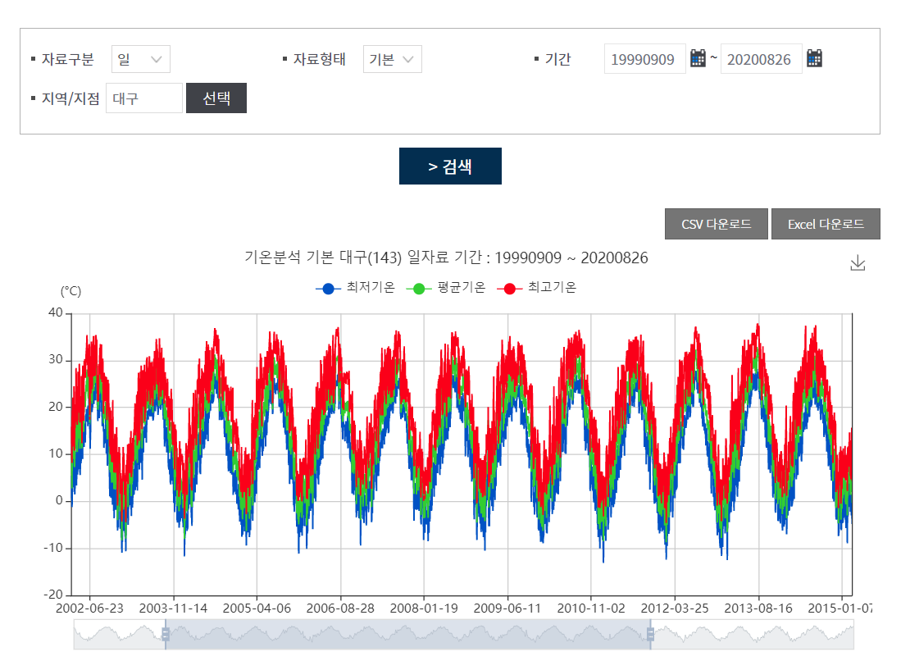
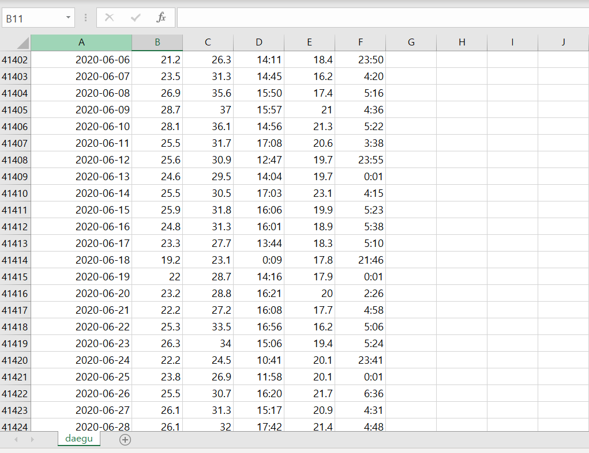
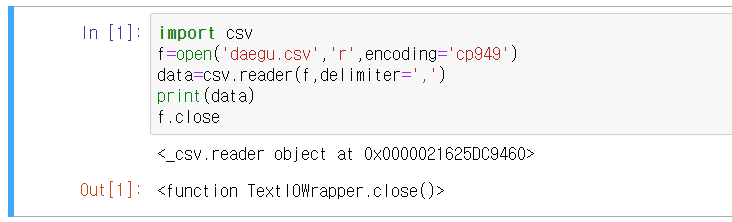
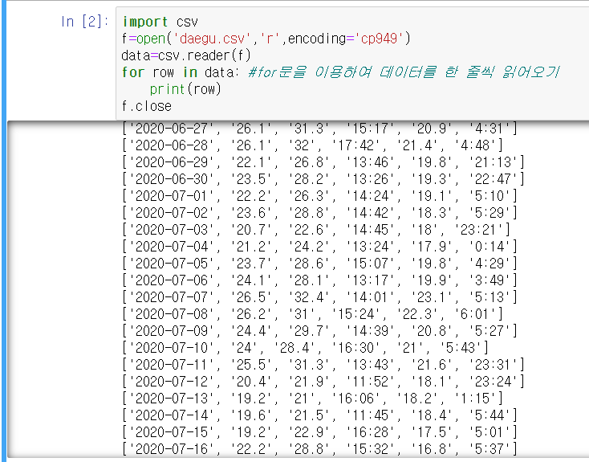

# 01. 기온공공데이터

## UNIT01 기온 데이터 분석 시작하기

1. 기상청은 [기상자료개방포털](https://data.kma.go.kr) 홈페이지를 통해 기상 관련 데이터를 무료로 제공합니다.

2. 기온 데이터를 사용할 것이기 때문에 기후통계분석->기온분석을 눌러줍니다.   
기간과 지역을 선택해서 데이터를 얻을 수 있습니다.
   
또한 CSV나 Excel 파일로 데이터를 저장 할 수 있습니다. CSV파일로 데이터를 저장해 봅시다.

3. CSV파일이란? Comma-Separated Values로 데이터 값을 콤마(,)로 구분하는 파일 형식입니다.
   
다음 파일은 순서대로 일시,평균기온,최고기온,최고기온 시각,최저기온,최저기온 시각을 나타냅니다.

4. 본격적으로 데이터분석을 시작하기 위해 환경을 설정해 줘야 합니다. 파이썬을 사용할건데 필요한 라이브러리를 편하게 불러오기 위해 아나콘다를 설치해주세요.

## UNIT02 대구의 기온 데이터 분석하기

1. 아나콘다에서 주피터 노트북을 실행시켜줍니다. 주피터 노트북은 일부 코드의 실행 결과를 바로 확인 할 수 있다는 장점이 있습니다.

2. 쥬피터 노트북에서 새 파이썬 노트북을 만들고 본격적으로 코드를 작성해봅시다.

3. CSV에서 데이터 읽어오기
```python
import csv
f=open('daegu.csv','r',encoding='cp949') #csv파일을 읽기 모드로 열어 cp949 형식(window 한글 인코딩 방식)으로 읽어온 후 f에 저장
data=csv.reader(f,delimiter=',') #읽어온 데이터를 ,를 기준으로 분리해서 data에 저장 파이썬에서 기본으로 지정한 값이므로 delimiter를 ,로 사용할 때는 생략이 가능
print(data)
f.close
```
   
->data객체를 출력한 결과값

4. 데이터 값을 실제로 출력하기
```python
import csv
f=open('daegu.csv','r',encoding='cp949') 
data=csv.reader(f)
for row in data: #for문을 이용하여 데이터를 한 줄씩 읽어오기
    print(row)
f.close
```
   
※ 예전 데이터는 기온 값이 누락된 경우가 있습니다.

5. 헤더 저장하기   
header란? 데이터들이 어떤 의미를 갖는지 표시한 행. 보통 첫 번째 줄.
```python
import csv
f=open('daegu.csv','r',encoding='cp949') 
data=csv.reader(f)
header=next(data) #next() 첫 번째 데이터 행을 읽어오고 데이터 탐색 위치를 다음 행으로 이동
print(header)
f.close
```
   

## UNIT03 대구가 가장 더웠던 날 구해보기
1. 데이터를 읽어온 후 최고 기온을 확인합니다.
2. 최고 기온이 가장 높았던 날의 데이터를 저장합니다.
3. 데이터 탐색이 끝난 후 마지막으로 저장된 데이터를 출력해줍니다.

```python
import csv
f=open('daegu.csv','r',encoding='cp949')
data=csv.reader(f,delimiter=',')
header=next(data)
max=-999 #최고 기온을 저장할 변수
max_date='' #최고 기온이었던 날짜를 저장할 변수
for row in data:
    if row[2]=='': #row[2]는 최고기온을 저장하고 있는 리스트의 위치다. 만약 데이터가 없다면 아주 작은 값으로 저장해주자. 
        row[2]=-999
    row[2]=float(row[2]) #크기 비교를 위해 문자열 데이터를 실수형 데이터로 바꿔준다.
    if max < row[2]: #최고 기온보다 더 큰 기온값이 나타나면 max 값을 업데이트 해준다.
        max=row[2]
        max_date=row[0] #최고 기온 날짜도 업데이트 해준다 
print(max,max_date)
f.close()
```
   
-> 대구가 가장 더웠던 날은 1942년 8월 1일이고 그 때의 기온은 40도였습니다!

