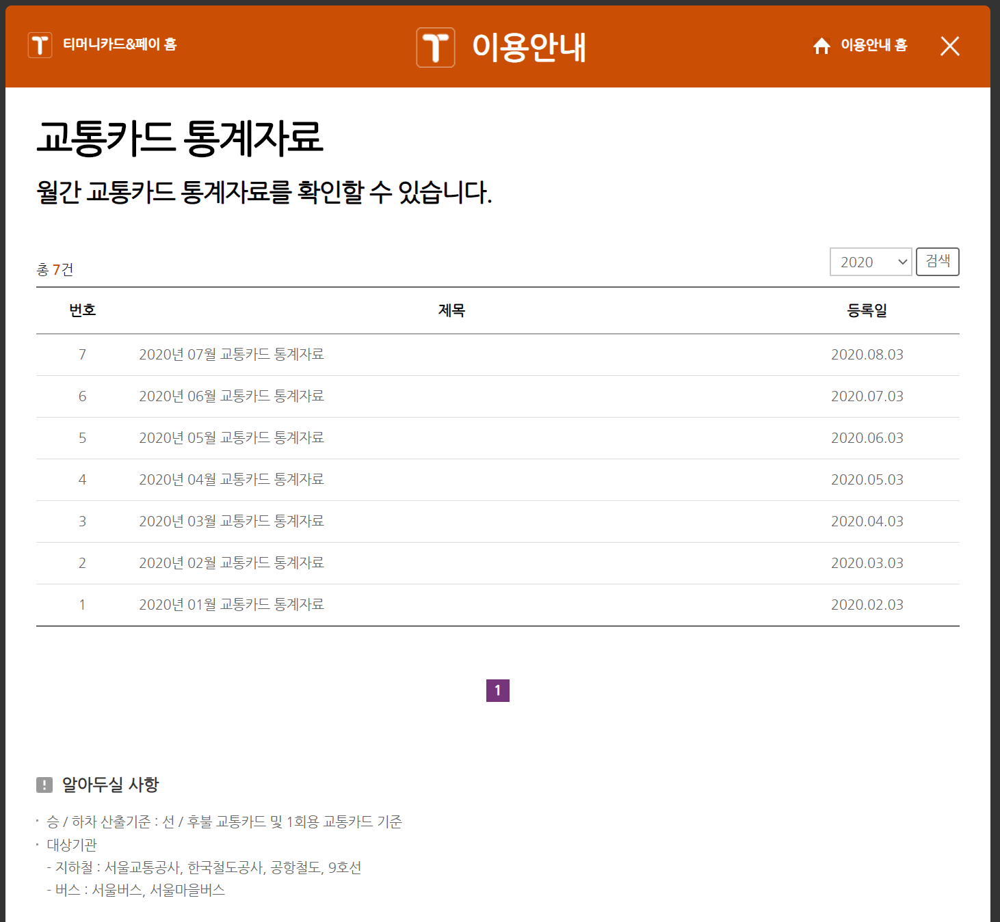
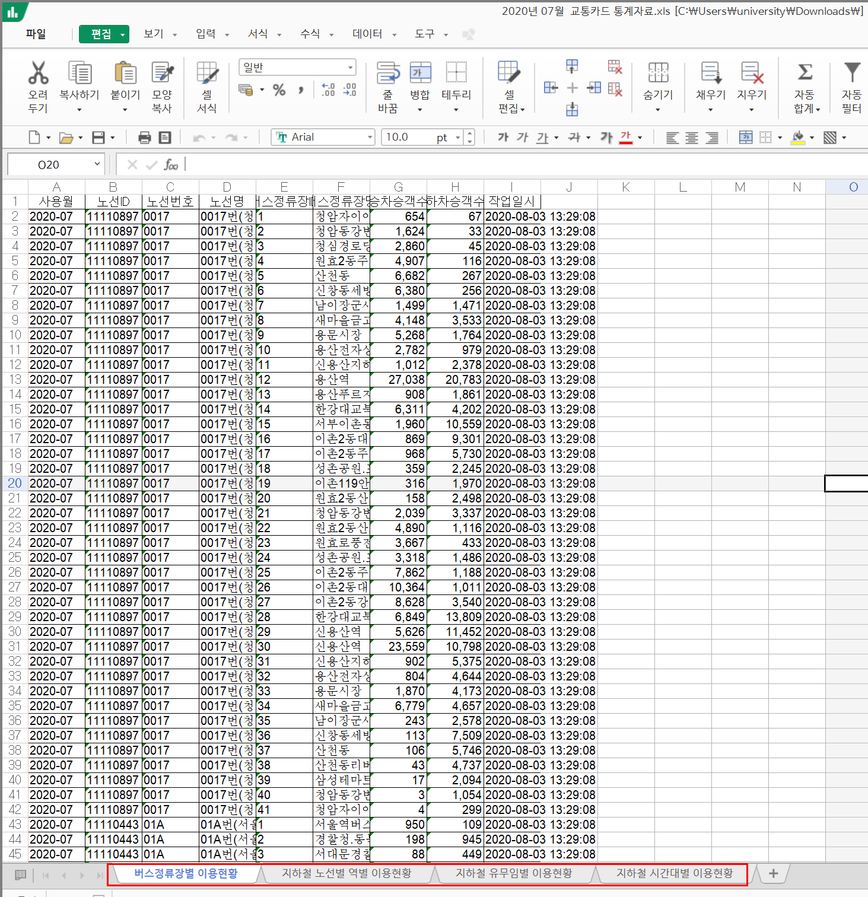
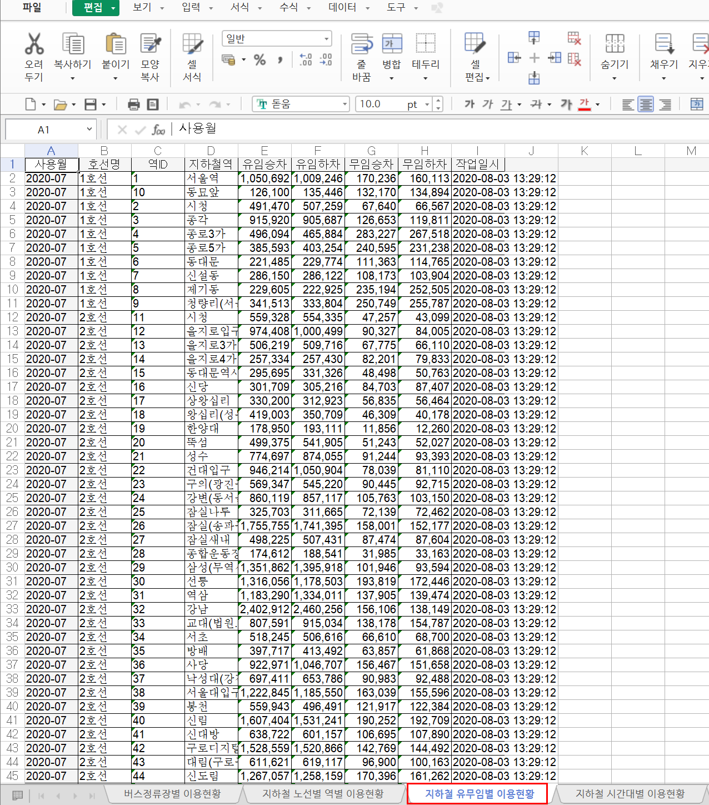
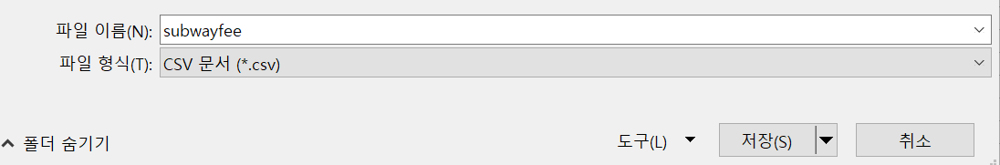
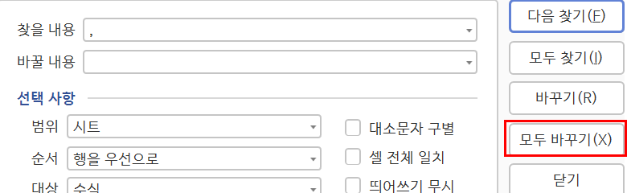
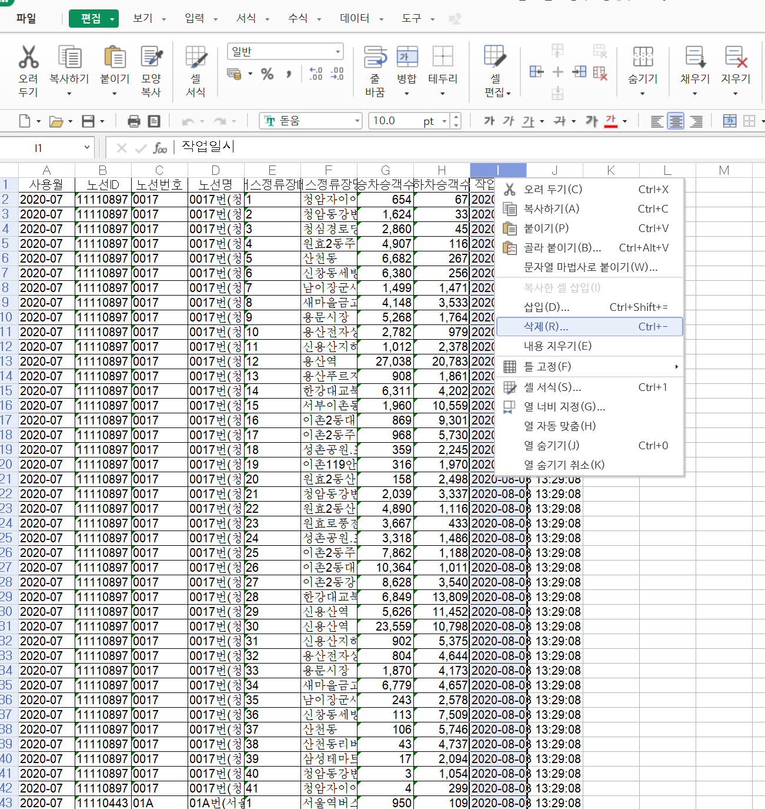
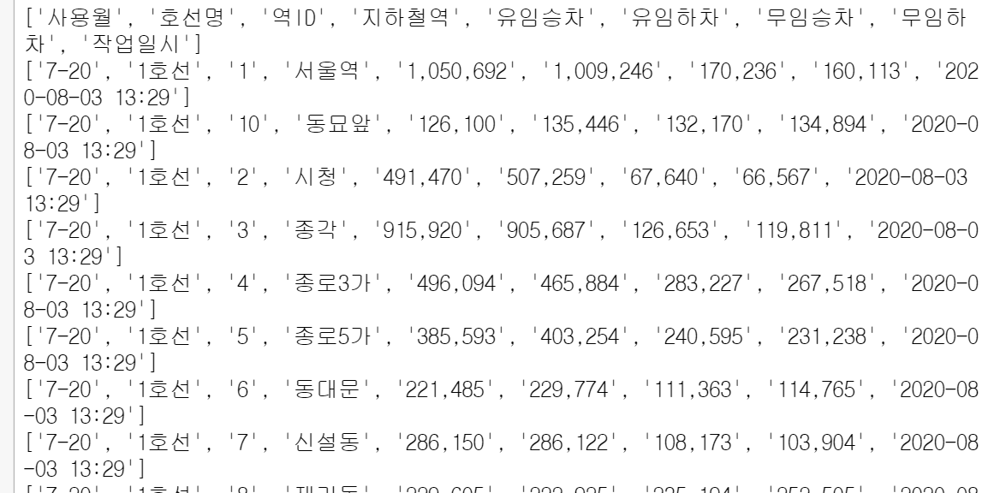
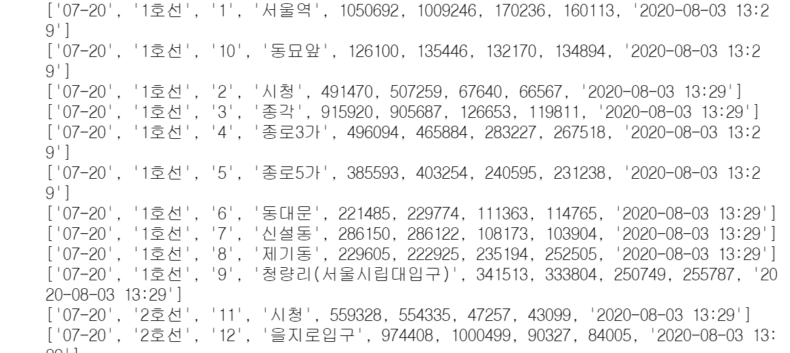

# 04. 대중교통 데이터 프로젝트

###### 여러분은 얼마나 자주 대중교통을 이용하나요? 대중교통은 정해진 노선과 계획된 시간에 따라 운행되며 정해진 요금을 지불하여 이용할 수 있는 서비스를 말합니다. 대중교통을 이용하는 사람들이 많아질수록 대기오염과 교통 체증을 줄일 수 있지요. 또한, 일주일에 하루씩 자동차 운전을 줄이고 대중교통을 이용하면 연간 약 30만 원을 절약하는 경제적 효과도 있습니다. 그렇다면 대중교통을 이용하는 승객은 얼마나 될까요? 넷째마당에서는 수도권 대중교통 데이터를 바탕으로 시각화를 연습합시다.

## 1. 대중교통 데이터 내려받기

1) 수도권 대중교통 데이터는 국가기관이 아닌 티머니 홈페이지(http://www.t-money.co.kr/) 에서 제공합니다. 따로 로그인 절차 없이 홈페이지에 접속해서 이용안내를 선택합니다.


2) 이용안내 메인 창에서 대중교통 통계자료를 선택합니다.

3) 최근 월간 교통카드 통계자료 게시글에서 엑셀 첨부 파일을 클릭해서 내려받습니다.

4) 내려받은 파일을 열어보면 '버스정류장별 이용현황', '지하철 노선별 역별 이용현황', '지하철 유무임별 이용현황', '지하철 시간대별 이용현황' 이렇게 4개의 탭을 확인할 수 있습니다.

지금부터 대중교통 데이터를 활용해서 다양한 시각화를 해보겠습니다. 우리가 먼저 활용할 데이터는 '지하철 유무임별 이용현황'데이터입니다.
(여기서 무임승차는 만 65세이상의 데이터를 의미한다.)

## 2. 지하철 유무임별 이용현황 데이터 정제하기
1) 4개의 탭 중 지하철 유무임별 이용현황 탭을 선택합니다.

2) 파일 -> 다른이름으로 저장을 눌러 파일이름을 subwayfee.csv로 수정하고 파일 형식을 CSV로 선택한 후 저장 버튼을 누릅니다.

데이터를 살펴보면 숫자에 콤마(,)가 포함되어 있고, '작업일시' 열(column)이 있습니다. 원활한 데이터 처리를 위해 불필요한 콤마를 지우고, 우리가 사용하지 않을 데이터인 '작업일시' 열도 지우겠습니다.
먼저 엑셀의 바꾸기 기능(`Ctrl + F`)을 활용해 콤마(,)를 모두 빈 문자로 바꿔줍니다. 


다음으로 '작업일시'데이터가 있는 열을 삭제합니다. 열의 맨 위 알파벳 부분을 마우스 오른쪽으로 클릭하여 '삭제'를 선택합니다.


이제 데이터가 잘 정제되었는지 확인해 볼까요?
```python
import csv
f = open('subwayfee.csv')
data = csv.reader(f)

for row in data:
    print(row)
```


실행 결과로 나온 데이터를 살펴보니 가장 윗줄에 각 열이 어떤 데이터인지 알려주는 헤더 데이터가 있습니다. 또 4번 열부터 7번 열까지 데이터가 작은 따옴표로 둘러싸인 것으로 보아 문자열로 처리되어 있네요. 헤더 데이터는 next() 함수로 제외하고 4번 열부터 7번 열까지 데이터는 정수(int)로 바꿔야겠습니다. 그래서 for 반복문을 사용해 각 열의 값을 정수로 바꿔줍니다.
next(data)

for row in data : 
    for i in range(4,8):
        row[i] = int(row[i])
    print(row)
    


##3. 유임승차 비율이 가장 높은 역은 어디일까

가장 먼저 '유임 승차 비율이 가장 높은(또는 낮은) 역은 어디일지 알아봅시다'

***유임 승차 비율이 가장 높은 역은 어디일까?***

유임 승차 비율이 가장 높다는 것은 어떻게 구할 수 있을까요?
먼저 무임 승차와 비교하여 유임 승차의 비율이 얼마나 되는지 생각할 수 있겠지요. 예를 들어 10명이 유임 승차를 했고, 4명이 무임 승차를 했다면 유임 승차 인원의 비율은 무임 승차 인원의 2.5배가 됩니다. 이런 식으로 계산했을 때 rate 값이 최대인 곳은 어디일까요?
`rate = 유임승차인원 / 무임승차인원`

다음과 같이 간단한 알고리즘을 생각할 수 있습니다. 
``

1. 데이터를 읽어온다.
2. 모든 역의 데이터를 바탕으로 각 역의 비율을 계산한다.
3. 비율이 가장 높은 역을 찾는다.
4. 비율이 가장 높은 역은 어디인지, 그 비율이 얼마인지 출력한다.

1은 구현이 되어있기 때문에 2~3부터 구현해보겠습니다. 먼저 각 역의 비율 데이터를 저장할 rate라는 변수와 rate의 최댓값을 저장할 mx라는 변수를 0으로 초기화합니다.
그리고 유임 승차 인원(row[4])을 무임 승차 인원(row[6])으로 나눈 rate 값을 계산하고 rate 값이 최대일 때를 찾습니다. 
```python
import csv
f = open('subwayfee.csv')
data = csv.reader(f)
next(data)
mx = 0
rate = 0
for row in data : 
    for i in range(4,8):
        row[i]=int(row[i])
    if row[6] == 0 :
        print(row)
    if row[6] != 0 :
        rate = row[4]/row[6]
    if rate > mx :
        mx = rate
        print(row, round(rate,2))
    
print(mx)
```

여기서 결과가 여러 줄이 나오는 이유는 rate값이 최댓값으로 업데이트될 떄마다 해당 데이터와 rate값을 출력하도록 만들었기 때문입니다.
이 결과에는 이상한 점이 보입니다. 환승이 가능한 역의 경우 유임하차, 무임하차 값이 0이 나오는 등 환승이 되는 부분이 계산되지 않음으로 다른 방법을 써야 합니다.
충무로역은 3호선과 4호선이 운행되는 환승역으로, 4호선 충무로역의 값과 함께 처리해야 할 것입니다.
그림 10

이번에는 유임 승차의 비율을 무임 승차 인원과 비교하는 방법이 아닌, 전체 인원 중 유임 승차 인원을 구하는 방법으로 데이터를 다뤄봅시다. 
***
변경전 > 변경후
***
`rate = 유임승차인원/무임승차인원` >> `rate = 유임승차인원/전체인원`
***

비율 계산 방식을 바꾸고, 유무임 승차 인원을 합해서 100,000명 이상인 경우만 찾는 것으로 코드를 수정했습니다.

