# 05. 파이썬 데이터 분석 라이브러리를 활용한 프로젝트

우리는 앞서 matplotlib 라이브러리를 활용해 데이터를 다양하게 시각화하는 방법을 배웠습니다. 다섯째 마당에서는 한 걸을 더 나아가, 여러 가지 숫자 데이터를 다룰 수 있는 numpy 라이브러리와 이를 기반으로 한 pandas 라이브러리 사용법을 알아보겠습니다.

## UNIT 13. 숫자 데이터를 쉽게 다루게 돕는 numpy 라이브러리

지금까지 우리가 다룬 matplotlib 라이브러리는 아주 기초적인 내용이고, 그중에서도 자주 사용되는 기능들을 중심으로 살펴보았습니다. 더 자세한 내용이 궁금한 사람을 위해 이번 장에서는 matplotlib 홈페이지를 살펴보고 여러 가지 숫자 데이터를 다룰 수 있는 numpy 라이브러리를 실습해 봅시다.

### 1. matplotlib 홈페이지

matplotlib 홈페이지는 데이터 시각화와 관련된 다양한 예시를 제공하고 있습니다. 원하는 예시를 클릭하면 해당 그래프를 어떻게 그렸는지 알 수 있는 코드도 함께 제시하고 있습니다.
matplotlib.org에 접속한 후 상단에 있는 tutorials 메뉴를 클릭합니다.

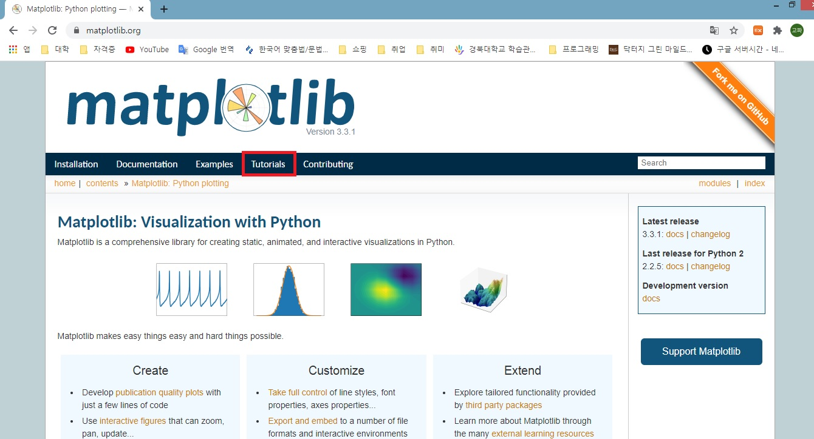
**그림 13-1** matplotlib 홈페이지

튜토리얼(tutorial)은 자습서 또는 안내서 성격의 문서로, matplotlib 라이브러리 뿐만 아니라 새로운 내용을 배울 때 '(찾고자 하는)키워드 tutorial'과 같은 형태로 검색하면 처음 시작할 때 큰 도움이 되는 내용을 찾을 수 있습니다.
연습 삼아서 검색 창에 numpy tutorial이라는 검색어를 입력해보세요.


**그림 13-2** tutorial 메뉴에서 numpy tutorial로 검색

검색 결과 페이지에서 스크롤을 내려 Pyplot tutorial을 클릭합니다.


**그림 13_3**검색 결과 중 Pyplot tutorial 클릭

내용을 살펴보면 지금까지 배운 내용들이 잘 정리되어 있습니다. 그중에서 다음과 같은 코드와 실행 결과가 보입니다.
```python
    import matplotlib.pyplot as plt
    import numpy as np
    t = np.arange(0., 5., 0.2)
    plt.plot(t, t, 'r--', t, t**2, 'bs', t, t**3, 'g^')
    plt.show()
```
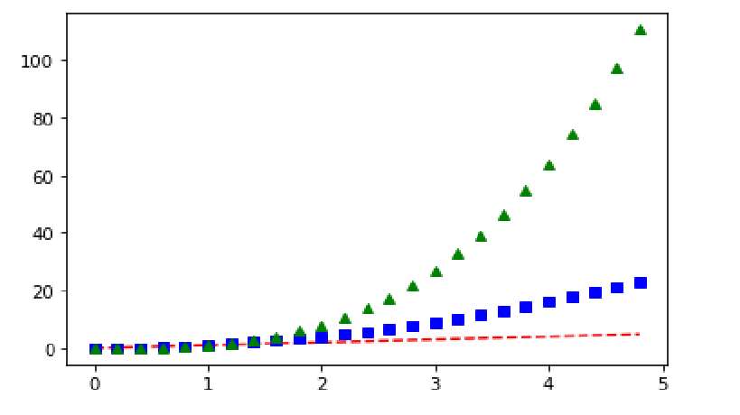
**그림 13_4**Pyplot tutorial 페이지에서 네 번째 그래프

코드 2행을 보니 numpy 라이브러리를 np라는 별명으로 부르는 것을 확인할 수 있습니다. 이 코드는 파이썬 리스트를 사용해서 다음과 같이 구현할 수 있습니다.
```python
    import matplotlib.pyplot as plt
    t = []
    p2 = []
    p3 = []
    for i in range(0, 50, 2) :
        t.append(i / 10)
        p2.append((i / 10) ** 2)
        p3.append((i / 10) ** 3)
    plt.plot(t, t, 'r--', t, p2, 'bs', t, p3, 'g^')
    plt.show()
```
실행하면 그림 13-4와 동일한 그래프가 나옵니다.
numpy 라이브러리를 사용한 코드와 파이썬 리스트를 사용한 코드의 실행 결과는 똑같지만, numpy 라이브러리를 사용한 경우가 훨씬 적은 수의 코드로 작성하여 간결합니다.
그리고 홈페이지에 소개된 내용을 더 살펴보면 이 예제뿐만 아니라 다른 예제에서도 np로 시작하는 numpy 라이브러리를 활용하는 코드들을 많이 볼 수 있습니다.
여러분도 이번 장에서 numpy 라이브러리를 배우면 숫자 데이터를 더 쉽게 다룰 수 있을 겁니다. 그러면 지금부터 numpy 라이브러리의 기초에 대해 하나씩 살펴 보겠습니다.

### 2. numpy 라이브러리 시작하기

먼저 간단한 함수부터 살펴보겠습니다. 다음 코드는 2의 제곱근을 출력합니다.
```python
    import numpy
    print(numpy.sqrt(2))
```

    실행 결과: 1.4142135623730951

그리고 앞에서 잠시 살펴봤던 것처럼 보통의 경우에는 다음과 같이 numpy 라이브러리를 np라는 이름의 별명으로 줄여서 쓸 수 있습니다.
```python
    import numpy as np
    print(np.sqrt(2))
```
이번엔 파이와 삼각함수를 사용하는 방법을 살펴보겠습니다. 다음과 같이 np.pi라고 작성하면 파이 값을 활용할 수 있습니다.
```python
    import numpy as np
    print(np.pi)
    print(np.sin(0))
    print(np.cos(np.pi))
```

    실행 결과:   3.141592653589793
                0.0
                -1.0

다음으로 무작위 값을 생성하는 랜덤 함수를 살펴보겠습니다. random 라이브러리를 통해서도 다양한 랜덤 함수를 사용할 수 있었지요? numpy 라이브러리의 랜덤 함수와 어떤 차이점이 있을지 생각하며 실습해 봅시다.
numpy 라이브러리에는 다양한 서브(sub) 라이브러리가 있는데 그 중 random 서브 라이브러리에 있는 rand() 함수를 실행하면 0~1 사이에 있는 n개의 실수가 랜덤하게 생성됩니다.
```python
    import numpy as np
    a = np.random.rand(5)
    print(a)
    print(type(a))
```

    실행 결과:   [0.49035568 0.69782018 0.12051989 0.27050388 0.73912559]
                <class 'numpy.ndarray'>

실행 결과를 확인해보니 리스트와 비슷하게 생긴 numpy.ndarray 타입의 데이터가 생성된 것을 볼 수 있습니다. ndarray에서 nd는 N - Dimensional, 즉 'N 차원'이라는 의미이고 array는 '배열'이라는 의미입니다.
이 코드는 어떻게 보면 random 라이브러리의 randint() 함수의 실수(real number) 버전이라고 생각할 수 있습니다.
그리고 이번에 살펴볼 choice() 함수는 random 라이브러리에서는 표현하기 어려운 랜덤 데이터를 생성합니다.
```python
    import numpy as np
    print(np.random.choice(6, 10))
```

    실행 결과: [1 5 3 0 5 1 0 4 0 1]

실행 결과에서 짐작할 수 있듯이 0~5 사이의 숫자를 랜덤하게 10번 선택했습니다. 만약 한 번 뽑은 숫자를 다시 뽑지 못하게 하고 싶다면 replace 속성을 False로 설정하면 됩니다.
다음처럼 말이죠.
```python
    print(np.random.choice(10, 6, replace=False))
```
    실행 결과: [1 8 3 4 7 2]
    
    Tip: 여기에서는 0~9 사이에 있는 숫자를 중복 없이 6번 뽑았습니다.

여기에 확률을 지정할 수 잇는 p 속성을 추가하겠습니다. p 속성은 각 경우의 수가 발생할 확률을 정할 수 있습니다. 0~5까지의 경우가 발생할 수 있으므로 0이 나올 확률부터 5가 나올 확률까지 하나씩 지정할 수 있습니다.
따라서 이 경우에는 p 속성에 6개의 확률이 있어야 하고 그 합이 반드시 1이어야 합니다. 0은 0.1, 1은 0.2, 2는 0.3, 3은 0.2, 4는 0.1, 5는 0.1의 확률을 지정하여 프로그램을 실행하겠습니다.
```python
    import numpy as np
    print(np.random.choice(6, 10, p=[0.1, 0.2, 0.3, 0.2, 0.1, 0.1]))
```
    실행 결과: [4 1 1 2 2 1 2 2 1 3]

0과 5는 나오지 않았고 1이 네번, 2가 4번, 3이 1번, 4가 1번 나왔네요. 한 번 더 실행하겠습니다.

    실행 결과: [1 2 1 2 2 2 2 2 4 2]

이번에는 0과 3과 5가 나오지 않았고, 1이 2번, 2가 6번, 4가 1번 나왔습니다. 꼭 우리가 정한 확률대로 결과가 나오지는 않는 것 같습니다.
더 많은 숫자를 발생시킨다면 p 속성으로 지정한 확률에 대한 검증이 가능할 것 같습니다. 얼마나 많은 숫자를 발생시켜야 할까요?
궁금증을 가지고 다음 내용으로 넘어가 봅시다.

### 3. numpy 라이브러리를 활용해 그래프 그리기

0부터 5까지의 숫자가 랜덤으로 출력되는 실행 결과를 보며, 각 숫자가 출력되는 횟수를 쉽게 확인하는 방법을 고민할 수 있습니다. 히스토그램을 그려 각 숫자의 빈도가 한눈에 들어오도록 합시다.
그리고 numpy 라이브러리의 장점을 확인하기 위해 Unit 6에서 random 라이브러리와 리스트를 사용했던 코드와 비교해 보겠습니다.

**numpy를 사용한 코드**
```python
    import matplotlib.pyplot as plt
    import numpy as np
    dice = np.random.choice(6, 10)

    plt.hist(dice, bins =6)
    plt.show()
```
**Unit 6에서 사용한 코드**
```python
    import matplotlib.pyplot as plt
    import numpy as np
    dice = []
    for i in range(10) :
        dice.append(np.random.randint(1,6))
    
    plt.hist(dice, bins = 6)
    plt.show()
```
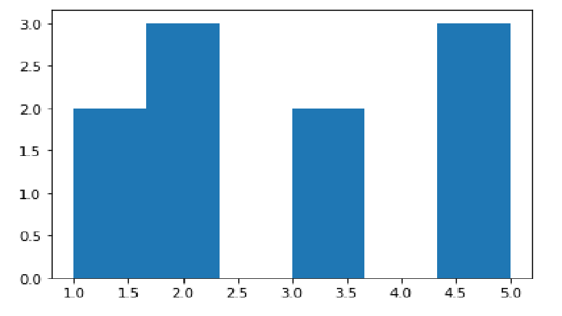
**그림 13_5**두 가지 히스토그램 그리기 코드 실행 결과

두 코드를 비교하니 결과는 같지만, numpy를 사용한 코드가 더 간결합니다.
그러고 반복 횟수를 10번이 아니라 100만 번으로 바꿔서 각각의 코드를 실행하면 numpy를 사용한 코드의 실행 속도가 훨씬 빠르다는 것을 느낄 수 있습니다.
여기에서 다음과 같이 p 속성으로 확률을 설정항여 결과를 확인하겠습니다.
```python
    import matplotlib.pyplot as plt
    import numpy as np
    dice = np.random.choice(6, 1000000, p=[0.1, 0.2, 0.3, 0.2, 0.1, 0.1])
    plt.hist(dice, bins = 6)  #0,1,2,3,4,5 중 랜덤으로 추출한 숫자를 히스토그램 표현
    plt.show()
```

**그림 13_6**더 많은 개수의 숫자를 랜덤으로 추출한 결과

반복 횟수를 늘려 더 많은 개수의 숫자를 랜덤으로 추출한 결과를 히스토그램으로 나타냈습니다. 그림 13-5와는 다르게 우리가 설정한 확률에 따라 각각의 값들이 나온 것을 확인할 수 있습니다.
다음은 Unit 10에서 그렸던 버블 차트를 numpy 라이브러리를 활용해서 다시 그리는 코드입니다. 반복문을 사용하지 않아서 코드가 간결해진 것을 느낄 수 잇을 겁니다.

<U>**코드**</U> **numpy를 사용한 버블 차트 그리기 코드**
```python
    import matplotlib.pyplot as plt
    import numpy as np

    x = np.random.randint(10, 100, 200)
    y = np.random.randint(10, 100, 200)
    size = np.random.randint(100)

    plt.scatter(x, y, s=size, c=x, cmap='jet', alpha=0.7)
    plt.colorbar()
    plt.show()
```
<U>**코드**</U> **Unit 10에서 사용한 버블 차트 코드**
```python
    import matplotlib.pyplot as plt
    import numpy as np

    x = []
    y = []
    size = []

    for i in range(200) :
        x.append(np.random.randint(10,100))
        y.append(np.random.randint(10,100))
        size.append(np.random.randint(10,100))

    plt.scatter(x, y, s=size, c=x, cmap='jet', alpha=0.7)
    plt.colorbar()
    plt.show()
```
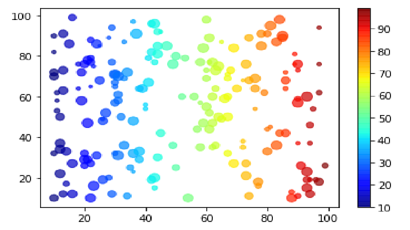
**그림 13-7**numpy 라이브러리를 활용해 표현한 히스토그램

numpy.random.randint() 함수에 입력된 10, 100, 200의 의미를 생각해 봅시다. 먼저 10, 100은 랜덤으로 추출될 숫자의 법위, 즉 10부터 100까지의 범위 안에서 무작위로 숫자를 추출한다는 의미입니다.
따라서 10부터 100 사이에 정수 200개가 랜덤하게 생성됩니다.
명령어가 의미하는 바는 같지만, 코드는 다르게 작성된 것을 확인할 수 있습니다. numpy 라이브러리를 사용하여 코드를 작성하면 for 반복문을 사용하지 않고도 많은 숫자 데이터를 생성할 수 있습니다.

**TIP** np.random.rand(n)는 0~1 사이에 있는 n개의 실수(float)를 만들고, randitn(a,b,n)는 a 이상, b 이하인 정수 n개를 만드는 함수 입니다.

### numpy array 생성하기

numpy 라이브러리에서는 ndarray라는 특별한 데이터 타입의 배열이 사용됩니다. numpy를 사용하려면 ndarray 타입 배열을 다루는 데 익숙해질 필요가 있습니다.
'N 차원 배열'이라는 의미를 지는 ndarray 타입 배열을 지금부터는 배열 또는 array라고 부르겠습니다.
리스트와 같은 연속된 데이터는 다음과 같이 numpy array로 변환할 수 있습니다.
```python
    import numpy as np
    a = np.array([1,2,3,4])
    print(a)
```

    실행 결과: [1 2 3 4]

실행 결과를 살펴보면 양 끝에 []가 붙는 점이 리스트와 비슷합니다. 하지만 numpy array는 리스트 내 요소를 구분하는 쉼표(,)가 없다는 차이점이 있습니다.
numpy array는 생긴 모습도 리스트와 비슷하지만, 리스트의 특징인 인덱싱과 슬라이싱을 할 수 있다는 점도 비슷합니다.
```python
    import numpy as np
    a = np.array([1,2,3,4])
    print(a[1], a[-1])
    print(a[1:])
```

    실행 결과:   2 4
                [2 3 4]

ndarray의 특정 인덱스에 해당하는 값을 출력하거나 슬라이싱 결과를 출력하는 것이 잘 이루어짐을 확인할 수 있습니다.
그러나 정수, 문자열, 리스트 등 다양한 데이터 타입을 담을 수 있었던 리스트와는 달리 numpy array에는 한 가지 타입의 데이터만을 저장할 수 있습니다. 예를 들어,
숫자와 문자가 함께 저장되었다면 문자로 변환되어 저장되는 것이지요.
다음과 같이 3개의 정수와 1개의 문자가 저장된 리스트를 배열로 변환하면 모두 같은 문자 타입으로 변환됩니다.
```python
    import numpy as np
    a = np.array([1,2,'3',4])
    print(a)
```

    실행 결과: ['1' '2' '3' '4']

배열을 생성하기 위해 꼭 리스트가 있어야하는 것은 아닙니다. zeros(), ones(), eye() 같은 다양한 함수를 사용해서 배열을 초기화할 수도 있습니다.
```python
    import numpy as np
    a = np.zeros(10) # 0으로 이루어진 크기가 10인 배열 생성
    print(a)
```

    실행 결과: [0. 0. 0. 0. 0. 0. 0. 0. 0. 0.]

```python
    import numpy as np
    a = np.ones(10)  # 1로 이루어진 크기가 10인 배열 생성
    print(a)
```

    실행 결과: [1. 1. 1. 1. 1. 1. 1. 1. 1. 1.]

```python
    import numpy as np
    a = np.eye(3)  # 3행 x 3열의 단위 배열 생성
    print(a)
```

    실행 결과:   [[1. 0. 0.]
                [0. 1. 0.]
                [0. 0. 1.]]

앞서 살펴본 세 가지 예는 0 또는 1로 배열을 채우고 싶을 때 무척 유용합니다.
하지만 0과 1이 아닌 연속된 숫자로 데이터를 생성하는 것은 어떻게 할 수 있을까요?
다음은 연속된 숫자로 데이터를 생성하는 것을 보여주는 예시로, numpy의 arange() 함수는 값을 3개까지 입력하여 사용할 수 있습니다.
```python
    import numpy as np
    print(np.arange(3))     # arange() 함수에 1개 값 입력
    print(np.arange(3,7))   # arange() 함수에 2개 값 입력
    print(np.arange(3,7,2)) # arange() 함수에 3개 값 입력
```

    실행 결과:   [0 1 2]
                [3 4 5 6]
                [3 5]

arange() 함수에 값을 하나만 입력할 경우, 0부터 해당 숫자보다 1만큼 작은 경우까지 저장된 배열이 만들어집니다. 값을 두 개 입력할 경우, 첫 번째 숫자부터 두 번째 숫자보다 1만큼 작은 정수까지 저장된 배열이 만들어집니다.
값을 세 개 입력할 경우, 첫 번째 숫자부터 두 번째 숫자보다 1만큼 작은 정수까지의 범위에서 세 번째 숫자만큼의 간격을 둔 숫자가 저장된 배열이 만들어집니다.
또 다른 숫자를 생성하는 방법으로 numpy의 linspace() 함수를 사용할 수 있습니다.
```python
    import numpy as np
    a = np.arange(1, 2, 0.1)  # 1이상 2미만 구간에서 0.1 간격으로 실수 생성
    b = np.linspace(1, 2, 11) # 1부터 2까지 11개 구간으로 나눈 실수 생성
    print(a)
    print(b)
```

    실행 결과:   [1.  1.1 1.2 1.3 1.4 1.5 1.6 1.7 1.8 1.9]
                [1.  1.1 1.2 1.3 1.4 1.5 1.6 1.7 1.8 1.9 2. ]

numpy의 linspace() 함수는 특정 구간을 쪼개어 값을 생성한다는 점에서 arange() 함수와 비슷합니다. 하지만 arange() 함수에서는 간격을 지정하고 linspace() 함수에서는 구간의 개수를 지정한다는 점에서 차이가 있습니다.
두 함수는 다양하게 활용될 수 있으며 쓰임에 다소 차이가 있기에 사용하고자 하는 목적에 맞게 사용하면 됩니다. 특정 간격에 해당하는 값을 생성하고  싶을 때는 arange() 함수를, 특정 개수의 구간으로 나눈 값을 생성하고 싶을 때는 linspace() 함수를 사용할 수 있습니다.
```python
    import numpy as np
    a = np.arange(-np.pi, np.pi, np.pi/10)
    b = np.linspace(-np.pi, np.pi, 20)
    print(a)
    print(b)
```

    실행 결과:   [-3.14159265 -2.82743339 -2.51327412 -2.19911486 -1.88495559 -1.57079633
                -1.25663706 -0.9424778  -0.62831853 -0.31415927  0.          0.31415927
                0.62831853  0.9424778   1.25663706  1.57079633  1.88495559  2.19911486
                 2.51327412  2.82743339]
                [-3.14159265 -2.81089869 -2.48020473 -2.14951076 -1.8188168  -1.48812284
                -1.15742887 -0.82673491 -0.49604095 -0.16534698  0.16534698  0.49604095
                 0.82673491  1.15742887  1.48812284  1.8188168   2.14951076  2.48020473
                 2.81089869  3.14159265]

### 5. numpy array의 다양한 활용

그런데 np.zeros(), np.ones() 함수는 있는데 왜 np.twos(), np.threes() 함수는 없을까요? 만약 초기값이 5인 배열을 100개 만들고 싶으면 어떻게 하면 될까요?
바로 이 점이 numpy array를 우리가 알아야 하는 가장 큰 이유인 것 같습니다.
이해를 돕기 위해 다음 코드와 실행 결과를 살펴보겠습니다.
```python
    import numpy as np
    a = np.zeros(10) + 5
    print(a)
```

    실행 결과: [5. 5. 5. 5. 5. 5. 5. 5. 5. 5.]

이번에는 배열에 연산이 아닌 함수를 적용하겠습니다.
```python
    import numpy as np
    a = np.linspace(1, 2, 11)
    print(np.sqrt(a))   # a값의 제곱근을 출력함
```

    실행 결과:   [1.         1.04880885 1.09544512 1.14017543 1.18321596 1.22474487
                1.26491106 1.30384048 1.34164079 1.37840488 1.41421356]

보다시피 배열에 어떤 연산이나 함수를 적용하면 배열의 모든 값이 한꺼번에 계산되는 것을 알 수 있습니다. 이런 특성을 활용하면 다음과 같이 아주 간단한 코드로 그래프를 나타낼 수 있습니다.
```python
    import matplotlib.pyplot as plt
    import numpy as np
    a = np.arange(-np.pi, np.pi, np.pi/100)
    plt.plot(a, np.sin(a))
    plt.show()
```

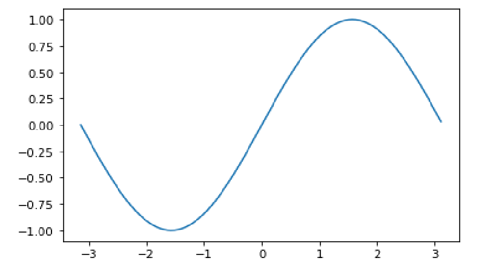
**그림 13-8**numpy 배열에 sin() 함수를 적용해 그래프로 나타낸 결과

이 코드의 3행은 pi 값을 기준으로 특정 범위를 생성하고, 범위 내 숫자들을 pi 값을 100으로 나눈 값만큼 간격을 두어 배열 a에 저장한 것입니다. 그런 다음 sin() 함수를 a에 저장된 값 전체에 적용한 후 그래프로 표현하였습니다. 
즉, 특정 구간의 sin() 함수의 모습을 쉽게 시각화할 수 있습니다.
이를 응용하여, 다음은 배열 a에 저장된 값을 바탕으로 sin() 함수와 cos() 함수를 표현한 것입니다. 6행을 보면 sin() 함수의 평행이동도 쉽게 구현할 수 있음을 보여줍니다.
```python
    import matplotlib.pyplot as plt
    import numpy as np
    a = np.arange(-np.pi, np.pi, np.pi/100)
    plt.plot(a, np.sin(a))
    plt.plot(a, np.cos(a))
    plt.plot(a+np.pi/2, np.sin(a))
    plt.show()
```

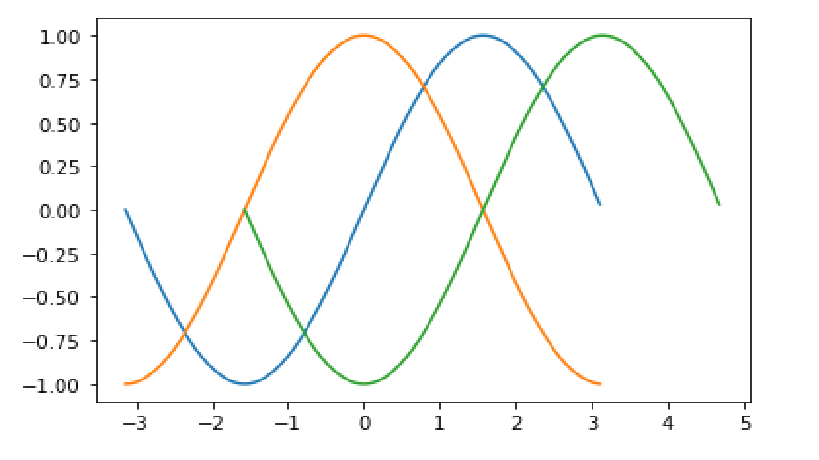
**그림 13-9**배열에 sin() 함수와 cos() 함수를 적용하여 그래프로 나타낸 결과

마지막으로 마스크(mask) 기능에 대해 알아보겠습니다. 마스크는 어떤 조건에 부합하는 데이터만 선별적으로 저장하기 위한 기능입니다.

**TIP** 마스크(mask)에 뚫린 부분과 막힌 부분이 있는 것을 떠올리면 조금 더 쉽게 이해될 겁니다.

예를 들어 다음처럼 a라는 배열을 만들었을 경우 0보다 작은 수는 -5부터 -1까지입니다.
```python
    import numpy as np
    a = np.arange(-5, 5)
    print(a)
```

    실행 결과: [-5 -4 -3 -2 -1  0  1  2  3  4]

numpy에서는 이런 상황을 배열 전체에 조건을 적용해서 다음처럼 표현할 수 있습니다. 그러면 배열에서 조건에 부합하는 데이터는 True, 그렇지 않은 데이터는 False인 마스크가 생성됩니다.
```python
    print(a<0)
```

    실행 결과: [ True  True  True  True  True False False False False False]

실행 결과를 살펴보면 배열 a에서 0보다 작은 값은 True, 같거나 큰 값은 False로 출력되었음을 알 수 있습니다.
이제 이 마스크를 다시 배열에 적용하면 다음과 같이 조건에 부합하는 데이터만 남습니다.
```python
    print(a[a<0])
```

    실행 결과: [-5 -4 -3 -2 -1]

그리고 마스크를 다음과 같이 변수에 넣어서 사용할 수도 있습니다.
```python
    mask1 = abs(a) > 3
    print(a[mask1])
```

    실행 결과: [-5 -4  4]

**TIP** 여기에서 'abs(a) > 3'은 'a 배열에 저장된 원소의 절대 값이 3보다 크다'라는 의미입니다.

또 이렇게 몇 개의 마스크를 연결해서 사용할 수도 있습니다.
```python
    mask1 = abs(a) > 3
    mask2 = abs(a) % 2 == 0
    print(a[mask1+mask2])    # 둘 중 하나의 조건이라도 참일 경우
    print(a[mask1*mask2])    # 두 가지 조건이 모두 참일 경우
```

    실행 결과:   [-5 -4 -2  0  2  4]
                [-4  4]

이 외에도 마스크는 다양하게 활용될 수 있는데요. 그림 13-7에서 만들었던 버블 차트에 마스크를 적용하면 어떤 그래프가 그려질지 직접 확인하세요!

### numpy 라이브러리를 사용하여 재미있는 버블 차트 그리기

```python
    import matplotlib.pyplot as plt
    import numpy as np
    x = np.random.randint(-100, 100, 1000) # 1000개의 랜덤 값 추출
    y = np.random.randint(-100, 100, 1000) # 1000개의 랜덤 값 추출
    size = np.random.randint(100)
    mask1 = abs(x) >50               # x에 저장된 값 중 절댓값이 50보다 큰 값 걸러 냄
    mask2 = abs(y) >50               # y에 저장된 값 중 절댓값이 50보다 큰 값 걸러 냄
    x = x[mask1+mask2]               # mask1과 mask2 중 하나라도 만족하는 값 저장
    y = y[mask1+mask2]               # mask1과 mask2 중 하나라도 만족하는 값 저장
    plt.scatter(x, y, s=size, c=x, cmap='jet', alpha=0.7)
    plt.colorbar()
    plt.show()
```

**실행결과**

**그림13-10**버블 차트에 마스크를 적용한 결과

지금까지 numpy 라이브러리와 아주 기초적인 사용 방법을 살펴보았습니다. 이 책에서는 numpy array의 내부 원리 등은 다루지 않고 이 정도 수준에서 가볍게 활용하는 방법만을 다룹니다.
만약 더 자세한 내용이 궁금하다면 전문적인 도서를 읽어보거나, 인터넷에 있는 numpy 문서들을 참고하세요.

## 14. numpy를 활용한 나만의 프로젝트 만들기

지난 시간에 우리는 numpy 라이브러리를 사용하는 방법을 배웠습니다. 이번 시간에는 numpy를 활용하여 '우리 동네 인구 구조와 가장 비슷한 곳을 찾는' 간단한 프로젝트를 만들겠습니다.
특히 이번 프로젝트는 여러분이 이 책을 다 읽고 난 후 여러분만의 데이터 프로젝트를 만드는 데 도움이 되도록, 프로젝트를 점진적으로 완성하는 과정을 보여주려고 합니다.
이번 프로젝트를 진행하면서 나만의 프로젝트에 대한 구상을 함께 해보길 바랍니다.

### 1. 관심 있는 데이터 찾기

나만의 데이터 프로젝트를 시작하는 데는 다양한 절차가 있지만, 처음 시작하는 단계에서는 관심 있는 데이터를 찾는 것에서부터 시작하는 것이 좋습니다.
최근 공공기관에서 많은  공공데이터를 제공하기 때문에 이전에 소개했던 공공데이터포털(www.data.go.kr/)을 이용하거나, 인터넷 검색을 해보면 관심 있는 분야의 데이터를 쉽게 찾을 수 있습니다.


**그림 14-1** 공공데이터포털


**그림 14-2** 공공데이터포털에서 제공하는 다양한 데이터 사례


**그림 14-3** 구글에서 범죄율 데이터로 검색한 결과

물론 여러분이 원하는 데이터가 없을 수도 있지만, 검색을 하다 보면 흥미 있는 데이터를 찾을 수 있을 겁니다.  저도 다양한 데이터를 찾아보면서 이 책에 나오는 데이터(기온, 인구, 대중교통)들을 찾았고, 이 데이터에 다양한 질문을 던지면서 여러 가지 재미있는 프로젝트들을 진행할 수 있었습니다.
만약 다른 데이터를 찾는 것이 조금 어렵거나 번거롭다면 지금까지 실습한 기온, 인구, 대중교통 데이터에 색다른 질문을 던져서 진행해도 좋습니다. 저는 이 3가지 데이터 중에서 유독 재미있다고 생각하는 데이터가 있는데, 바로 '인구 데이터'입니다.
'인구 통계의 변화는 미래와 관련된 것 가운데 정확한 예측을 할 수 있는 유일한 사실'이라는 피터 드러커의 말처럼, 인구 데이터는 미래를 이해하는데 중요한 데이터입니다. 그리고 무엇보다도 인구 데이터를 보면서 다양한 질문을 던질 수 있기에, 여러 데이터 중 인구 데이터를 바탕으로 저만의 프로젝트를 시작하겠습니다.

### 2. 데이터 살펴보며 질문하기

관심 있는 데이터를 살펴보면 자연스럽게 질문이 떠오르기 마련입니다. Unit 7에서 다뤘던 인구 데이터를 다시 한번 살펴보겠습니다.

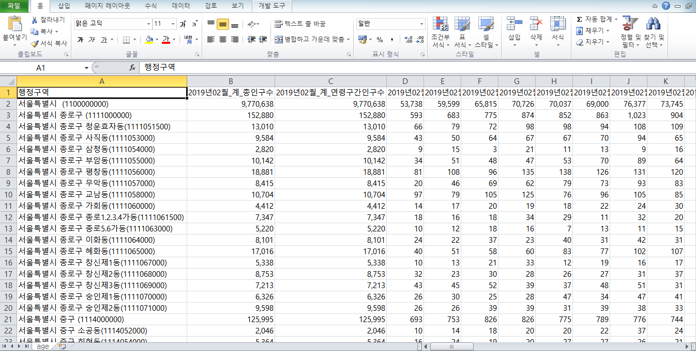
**그림 14-4**Unit 7에서 살펴본 age.csv 파일

데이터를 살펴볼 때는 엑셀과 같은 스프레드시트 프로그램을 활용해서 데이터를 구석구석 살펴보는 것이 좋습니다. 자신이 흥미가 있는 데이터를 보면서 데이터가 어떤 내용을 담고 있는지, 또 어떤 내용은 담고 있지 않은지, 데이터가 기록된 기간은 언제부터 언제까지인지, 어떤 형태로 시각화해보면 어떤 정보들을 알 수 있을 것 같은지 등의 질문을 던지다 보면 재미있는 질문들을 찾아낼 수 있을 겁니다.
저는 이 데이터를 살펴보며 다음과 같은 질문들을 떠올렸습니다. 여러분도 이 인구 데이터를 보며 떠오르는 질문이 있으면 적어보세요

* **전국에서 영유아들이 가장 많이 사는 지역은 어디일까?**

* **보통 학군이 좋다고 알려진 지역에는 청소년들이 많이 살까?**

* **광역시 데이터를 10년 단위로 살펴보면 청년 비율이 줄고 있다는 사실을 알 수 있을까?**

* **서울에서 지난 5년간 인구가 가장 많이 증가한 구는 어디일까?**

* **우리 동네의 인구 구조와 가장 비슷한 동네는 어디일까?**

이 질문들 중 일부는 추가적인 데이터를 찾아봐야 하는 경우도 있지만, 기본적으로는 우리가 갖고 있는 공공데이터에서 답을 찾을 수 있습니다. 이런 질문에 대한 답은 보통 인터넷 검색으로  찾기 어렵습니다. 이를 통해 지금 우리가 진행하려는 데이터 프로젝트가 그만큼 가치 있는 정보를 만들어내는 과정이라는 사실을 알 수 있습니다.

### 3. 질문을 명확한 문제로 정의하기

그렇지만 앞에서 던진 질문들은 조금 더 다듬을 필요가 있습니다. 예를 들어 '전국에서 가장 영유아가 많이 사는 지역은 어디일까?'라는 질문은 '전국에 있는 읍면동 중 만 0세 이상 6세 이하의 인구 비율이 높은 상위 10 곳은 어디일까?'라는 질문으로 바꿀 수 있습니다. 또 청년은 만 13세 이상 만 19세 미만의 인구, 청년은 만 19세 이상의 인구로 구체적인 나이를 언급한 질문으로 바꿀 수 있겠지요.
이렇게 문제를 명확히 정의하고 나면 현재 갖고 있는 데이터로 문제를 해결 할 수 있는지를 판단할 수 있을 뿐 아니라, 문제를 해결하기 위한 알고리즘을 설계하는 것도 훨씬 수월해집니다.
앞서 모든 질문에 대한 답을 찾아볼 수 있겠지만, 여기에는 한 가지 질문만을 선택해서 명확한 문제로 정의하겠습니다. 질문을 선택할 때는 가장 궁금하면서도 현재 지식과 능력으로 해결 가능한 것을 선택합니다.
개인적으로 내가 살고 있는 동네의 인구 구조와 가장 비슷한 동네를 찾는 질문이 가장 재미있을 것 같습니다. 이 질문에 대한 답을 찾으면 우리 동네뿐만 아니라 전국에 있는 모든 지역을 대상으로 가장 비슷한 지역이 어디인지 알 수 있을 겁니다.
그리고 그 결과는 상권을 분석하거나, 3~5년 후 발생할 수 있는 학교 수요, 공급 문제를 예측하는 데 도움을 줄 수 있을 것이기 때문입니다.
그러면 '우리 동네의 인구 구조와 가장 비슷한 지역은 어디일까?' 라는 질문을 '전국에서 신도림동의 연령별 인구 구조와 가장 형태가 비슷한 지역은 어디일까?'라고 다듬었습니다. 물론 문제를 좀 더 명확하게 정의할 수도 있지만, 이 정도로 생각해도 알고리즘을 생각하는 데 큰 무리는 없을 것 같습니다.

### 4. 알고리즘 설계하기

이제 문제를 해결하기 위한 절차, 즉 알고리즘을 설계하겠습니다. 알고리즘 설계에 앞서서 우리가 해결하려는 문제가 현재 가진 데이터(입력)로 해결할 수 있는 지 확인해야 합니다. 만약 현재 데이터로 불충분하다면 문제 해결에 필요한 데이터를 더 수집해야 하니까요.
우리가 해결하려는 문제는 '우리 동네의 인구 구조와 가장 비슷한 지역은 어디일까?'입니다. 문제 해결을 위해 필요한 데이터는 지역별 인구수를 연령대, 성별을 기준으로 구분한 자료입니다. 우리는 이러한 자료를 행정안전부 홈페이지에서 얻을 수 있었습니다(Unit 7). 따라서 문제 해결을 위해 필요한 데이터를 충분히 갖고 있다고 볼 수 있습니다.
현재 수집된 데이터로 문제를 해결할 수 있다면 문제를 해결하기 위한 절차를 차례대로 생각해 봅니다. 이 단계는 코드로 작성하는 것을 생각하는 것이 아니고 문제를 해결하기 위한 논리적인 절차를 생각하는 것입니다.
'전국에서 신도림동의 연령별 인구 구조와 가장 형태가 비슷한 지역은 어디일까?'라는 질문을 해결하기 위해 다음과 같은 5단계를 생각했습니다.

**1**| 데이터를 읽어온다.

**2**| 궁금한 지역의 이름을 입력받는다.

**3**| 궁금한 지역의 인구 구조를 저장한다.

**4**| 궁금한 지역의 인구 구조와 가장 비슷한 인구 구조를 가진 지역을 찾는다.

**5**| 가장 비슷한 곳의 인구 구조와 궁금한 지역의 인구 구조를 시각화한다.

이렇게 전체적인 흐름에 대해서 알고리즘을 생각한 후, 한 단계씩 해결할 수 있습니다. 함께 한 단계씩 해결해 볼까요?

**TIP** 각 단계를 코드로 구체화하는 과정에서 많은 시행착오가 있을 수 있습니다. 이번 장에서는 그런 시행착오를 지속적으로 개선하는 과정도 눈여겨 살펴본다면 여러분만의 데이터 프로젝트를 진행할 때 도움이 될 것입니다.

### 5. 알고리즘을 코드로 표현하기

이제 알고리즘의 각 단계를 코드로 표현하겠습니다.


* **1**| **데이터를 읽어온다.**

데이터는 Unit 7에서 수집했던 데이터를 그대로 사용하겠습니다. 따라서 데이터를 읽어오는 코드도 동일합니다.
```python
    import csv
    f = open('age.csv')
    data = csv.reader(f)
    for row in data :
        print(row)
```

    실행 결과:   ['행정구역', '2019년02월_계_총인구수', '2019년02월_계_연령구간인구수', '2019년02월_계_0세', '2019년02월_계_1세', '2019년02월_계_2세', '2019년02월_계_3세', '2019년02월_계_4세', '2019년02월_계_5세', '2019년02월_계_6세', '2019년02월_계_7세', '2019년02월_계_8세', (생략), '2019년02월_계_94세', '2019년02월_계_95세', '2019년02월_계_96세', '2019년02월_계_97세', '2019년02월_계_98세', '2019년02월_계_99세', '2019년02월_계_100세 이상']
                ['서울특별시  (1100000000)', '9,770,638', '9,770,638', '53,738', '59,599', '65,815', '70,726', '70,037', '69,000', '76,377', '73,745', '75,639', '70,189', '74,217', '80,273', '74,774', '71,529', '78,329', '82,561', '82,083', '90,416', '107,254', '109,552', '114,315', '122,473', '129,497', '141,673', '150,625', '156,258', '165,662', '165,771', '152,776', '151,006', '150,177', '144,503', '144,300', '145,260', '142,644', '157,624', '164,934', '168,159', '162,843', '162,014', '141,538', '145,260', '144,326', '146,145', '158,029', '165,333', '168,391', '176,426', '175,457', '169,300', '167,962', '154,449', '147,478', '149,781', '151,916', '141,921', '152,687', '159,184', '167,176', '157,349', '145,519', '142,867', '132,352', '135,608', '123,861', '103,339', '110,202', '83,062', '85,623', '88,133', '85,983', '86,008', '79,560', '60,652', '63,418', '59,401', '72,043', '60,979', '49,561', '47,432', '42,445', '37,293', '33,253', '29,705', '25,250', '20,503', '17,751', '14,506', '12,100', '10,729', '8,923', '7,199', '5,374', '3,972', '2,927', '2,813', '2,260', '1,565', '1,180', '880', '5,932']

그리고 데이터 처리에 불필요한 헤더 부분을 제외시키고자 next() 함수를 사용합니다.
```python
    import csv
    f = open('age.csv')
    data = csv.reader(f)
    next(data)
    for row in data :
        print(row)
```

* **2**| **궁금한 지역의 이름을 입력받는다.**

name 변수에 궁금한 지역의 이름을 입력받겠습니다. 입력받는 코드의 위치는 코드의 위치는 어디가 좋을지 생각해 보고 적절한 위치에 입력하세요.
```python
    name = input('인구 구조가 알고 싶은 지역의 이름(읍면동 단위)을 입력해주세요 : ')
```

* **3**| **궁금한 지역의 인구 구조를 저장한다.**
```python
    import csv
    f = open('age.csv')
    data = csv.reader(f)
    next(data)
    home = []                       # 입력받은 지역의 데이터를 저장할 리스트 생성
    name = input('인구 구조가 알고 싶은 지역의 이름(읍면동 단위)을 입력해주세요 : ')
    for row in data :
        if name in row[0] :         # 입력받은 지역의 이름이 포함된 행 찾기
            for i in row[3:] :      # 3번 인덱스 값부터 슬라이싱  
                home.append(int(i)) # 입력받은 지역의 데이터를 home에 저장
    print(home)                     # home에 저장된 데이터 출력
```

    실행 결과:   인구 구조가 알고 싶은 지역의 이름(읍면동 단위)을 입력해주세요 : 신도림
                [326, 334, 406, 413, 389, 408, 417, 434, 411, 387, 420, 383, 354, 357, 340, 338, 349, 339, 407, 380, 390, 453, 424, 516, 451, 466, 448, 484, 471, 476, 558, 541, 579, 619, 638, 740, 756, 792, 745, 789, 671, 687, 700, 636, 726, 691, 657, 619, 649, 585, 579, 470, 522, 534, 563, 445, 511, 569, 572, 513, 532, 456, 426, 497, 379, 384, 399, 279, 289, 276, 268, 271, 223, 170, 150, 154, 177, 140, 126, 114, 121, 97, 86, 80, 59, 48, 44, 43, 28, 29, 22, 15, 13, 12, 5, 8, 5, 4, 2, 3, 7]

여기서 9, 10행은 숫자 데이터를 한꺼번에 처리하는 부분으로 for 반복문을 사용하여 row의 3번 인덱스 값부터 끝 번 인덱스 값까지 저장합니다.
```python
    for i in row[3:] :
        home.append(int(i))
```
이 코드를 Unit 13에서 배운 숫자를 다루는 유용한 라이브러리인 numpy를 사용하여 수정하겠습니다.
```python
    import numpy as np
    import csv
    f = open('age.csv')
    data = csv.reader(f)
    next(data)
    home = [] 
    name = input('인구 구조가 알고 싶은 지역의 이름(읍면동 단위)을 입력해주세요 : ')
    for row in data :
        if name in row[0] :
        home = np.array(row[3:], dtype=int)
    print(home)
```

9행의 dtype = int는 리스트를 numpy 배열로 저장할 때 데이터 타입을 정수로 변환하라는 옵션입니다. 여기까지 잘 작성이 되었는지 중간 점검을 위해 그래프로 표현하겠습니다.
```python
    import matplotlib.pyplot as plt
    plt.rc('font', family='Malgun Gothic')
    plt.title(name1+' 지역의 인구 구조')
    plt.plot(home1)
    plt.show()
```

    실행 결과: 인구 구조가 알고 싶은 지역의 이름(읍면동 단위)을 입력해주세요 : 신도림동


**그림 14-5**numpy 라이브러리를 사용해서 신도림동의 인구 구조를 그래프로 나타낸 결과

* **4**| **궁금한 지역의 인구 구조와 가장 비슷한 인구 구조를 가진 지역 찾기**

이제 우리 프로젝트에서 가장 중요한 부분입니다. 특정 지역의 인구 구조와 가장 비슷한 인구 구조를 가진 지역을 어떻게 찾을 수 있을까요? 여러분들도 잠깐 고민 해보기 바랍니다.
만약 궁금한 지역을 A, 비교할 지역을 B라고 하면 A의 0세 인구수와 B의 0세 인구수의 차이, A의 1세 인구수와 B의 1세 인구수의 차이, 이런 식으로 A의 100세 이상 인구수와 B의 100세 이상 인구수의 차이를 모두 더했을 때 그 차이가 가장 작은 지역을 찾으면 어떨까요?
이것을 다시 알고리즘으로 표현하겠습니다.

**1.** 전국의 모든 지역 중 한 곳(B)을 선택한다.

**2.** 궁금한 지역 A의 0세 인구수에서 B의 0세 인구수를 뺀다.

**3.** **2**를 100세 이상 인구수에 해당하는 값까지 반복한 후 각각의 차이를 모두 더한다.

**4.** 전국의 모든 지역에 대해 반복하며 그 차이가 가장 작은 지역을 찾는다.

혹시 이 알고리즘을 보면서 문제가 될 것 같다고 생각이 드는 부분이 있나요?
다음 질문에 대한 답을 확인하며 이 알고리즘을 수정합시다.

***Q1. 서로 다른 인구를 가진 두 지역을 어떻게 비교할 수 있을까?***


**그림 14-6**신도림동과 화촌면의 인구 구조 그래프

그림 14-6의 그래프는 서울시 구로구 신도림동과 강원도 홍천군 화촌면의 연령별 인구를 그래프로 표현한 것입니다. 보는 것처럼 전체 인구수가 다른 두 지역에서, 연령별 인구수 차이를 구하는 형태로 비교하기는 어렵습니다.
따라서 '**2.** 궁금한 지역 A의 0세 인구수에서 B의 0세 인구수를 뺀다.'는 알고리즘은 수정이 필요합니다.
그러면 어떻게 비교해야 할까요? 인구 구조를 비료하려는 것이므로 비율로 비교하면 됩니다. 알고리즘을 이렇게 수정하겠습니다.

**1.** 전국의 모든 지역 중 한 곳(B)을 선택한다.

**2.** 궁금한 지역 A의 0세 인구 비율에서 B의 0세 인구 비율을 뺀다.

**3.** **2**를 100세 이상 인구수에 해당하는 값까지 반복한 후 각각의 차이를 모두 더한다.

**4.** 전국의 모든 지역에 대해 반복하며 그 차이가 가장 작은 지역을 찾는다.

비율을 구하려면 그 지역의 전체 인구수로 연령대별 인구수를 나누면 됩니다. 데이터에서 2번 인덱스에 전체 인구수가 저장되어 있으므로 아래와 같이 코드를 수정합니다.
```python
    home = np.array(row[3:], dtype=int) / int(row[2])
```

수정한 코드로 신도림동의 인구 구조 그래프를 그려보니 비율로 잘 나타난 것을 볼 수 있습니다.


**그림 14-7**신도림동의 연령대별 인구 비율을 그래프로 나타낸 결과

이렇게 비율을 적용하여 신도림과 화촌면 지역의 그래프를 그려보면, 각 지역에서 특정 연령층이 차지하는 비율을 쉽게 비교할 수 있습니다. 예를 들어, 20대의 비율은 신도림이 높으나, 60대의 비율은 화촌면이 높은 것을 쉽게 알 수 있습니다.


**그림 14-8**신도림동과 화촌면의 인구 구조 그래프

**TIP** 어떻게 하면 두 지역의 그래프를 동시에 그릴 수 있을깡요? 두 리스트에 서로 다른 지역의 데이터를 저장하고 그려주면 되겠죠? Unit 12의 마지막 코드를 참고해서 한번 도전해 보세요(200쪽).

***Q2. 한 번 불러온 데이터를 여러 번 사용하려면 어떻게 해야 할까?***

이제 궁금한 지역과 다른 지역의 연령별 인구 비율을 뺄 차례입니다. home에는 궁ㅇ금한 지역의 데이터가 저장되어 있으므로 새롭게 데이터를 찾기 위해 이런 코드를 작성했는데요. 이 코드가 실행되면 어떤 결과가 출력될까요?
```python
    import numpy as np
    import csv
    f = open('age.csv')
    data = csv.reader(f)    # **1.**
    next(data)
    name = input('인구 구조가 알고 싶은 지역의 이름(읍면동 단위)을 입력해 주세요 : ')
    for row in data :       # **2.**
        if name in row[0] :
            home = np.array(row[3:], dtype=int)/int(row[2])    # **3.**
    for row in data :    # **4.**
        print(row)       # **5.**
```

아마 대부분 전체 인구 데이터가 잘 출력되리라 예상했을 겁니다. 그러면 실제로 코드를 실행해보세요. 어떤 결과가 나오나요?
네, 인구 구조가 알고 싶은 지역의 이름을 입력해도 아무것도 출력되지 않습니다. 왜 그럴까요?
**1.**에서 읽어온 데이터는 **2.**를 거치면서 처음부터 마지막 줄까지 한 줄씩 아래로 읽힙니다. 따라서 **3.**의 for 반복문이 끝난 후에는 더 이상 읽을 수 있는 데이터가 없습니다. 그런 상태에서 **4.**~**5.**에서 다시 데이터를 읽으려고 하니 읽을 데이터가 없는 것이지요.
이 문제를 해결 할 수 있는 방법은 여러 가지가 있지만, 그중 하나는 데이터를 리스트로 저장하는 것입니다. 다음 코드를 next() 함수 다음 줄에 추가합니다.
```python
    data = list(data)
```

이 코드를 추가한 후 다시 실행을 시켜보면 데이터가 잘 출력되는 것을 볼 수 있습니다.

    실행 결과:   '서울특별시  (1100000000)', '9,770,638', '9,770,638', '53,738', '59,599', '65,815', '70,726', '70,037', '69,000', '76,377', '73,745', '75,639', '70,189', '74,217', '80,273', '74,774', '71,529', '78,329', '82,561', '82,083', '90,416', '107,254', '109,552', '114,315', '122,473', '129,497', '141,673', '150,625', '156,258', '165,662', '165,771', '152,776', '151,006', '150,177', '144,503', '144,300', '145,260', '142,644', (생략)

**TIP** 이렇게 알고리즘을 생각할 때는 생각지도 못했던 크고 작은 문제들이 계속 생기는 것을 볼 수 있습니다. 그리고 이런 문제들을 해결할 때는 혼자 고민하는 것도 중요하지만, 온오프라인의 친구들 또는 인터넷 검색(흔히 '구글링'이라고 말합니다)을 잘 하는 것도 중요합니다.

계속해서 알고리즘을 구현하겠습니다.


* **1.** **전국의 모든 지역 중 한 곳(B)을 선택한다.** **&** **2.** **궁금한 지역 A의 0세 인구 비율에서 B의 0세 인구 비율을 뺀다.**

먼저 home의 인구 비율에서 다른 지역의 인구 비율을 빼는 것을 코드로 표현하면 다음과 같습니다. 여기에서 다른 지역을  away라는 이름으로 지정했습니다.
```python
    import numpy as np
    import csv
    f = open('age.csv')
    data = csv.reader(f)
    next(data)
    data = list(data)
    name = input('인구 구조가 알고 싶은 지역의 이름(읍면동 단위)을 입력해 주세요 : ')
    for row in data :
        if name in row[0] :
            home = np.array(row[3:], dtype=int)/int(row[2]) # **1.**
    for row in data :
        away = np.array(row[3:], dtype=int)/int(row[2])     # **2.**
        print(home - away)                                  # **3.**
```

    실행 결과:   인구 구조가 알고 싶은 지역의 이름(읍면동 단위)을 입력해주세요 : 신도림동

**1.**은 사용자로부터 입력받은 지역의 연령대별 인구 비율을 home에 저장하는 코드입니다. **2.**은 다른 동네의 인구 비율을 away에 저장하는 것을, **3.** home에 저장된 인구 비율과 away에 저장된 값의 차를 출력하는 것을 의미합니다.

**TIP** 3.33517078e-03은 3.33517078 곱하기 10의 -3제곱이라는 의미로 0.00333517078을 의미합니다.

실행 결과를 확인하면 신도림의 연령대별 인구 비율과 다른 동네의 연령대별 인구 비율을 뺀 계산 결과가 출력되는 것을 알 수 있습니다. 다음 단계로 넘어가 볼까요?


* **3.** **2** **를 100세 이상 인구수에 해당하는 값까지 반복한 후 각각의 차이를 모두 더한다.**

값을 더할 때 for 반복문을 사용할 수도 있지만, 이제 그 정도 코드는 쉽게 작성할 수 있기 때문에 numpy의 sum() 함수를 사용하겠습니다. 출력 부분 코드를 조금 수정하면 합계가 출력됩니다.
```python
    print(np.sum(home-away))
```

    실행 결과:   인구 구조가 알고 싶은 지역의 이름(읍면동 단위)을 입력해 주세요 : 신도림동


                (생략)

실행 결과를 확인하면 10^-18 정도의 아주 작은 값이 나오는 것을 볼 수 있네요.


* **4** **전국의 모든 지역에 대해 반복하며 그 차이가 가장 작은 지역을 찾는다.**

이제 그동안 많이 해왔던 최솟값을 찾는 패턴의 문제입니다. 앞에서 많이 다뤄본 패턴이기 때문에 코드를 보면 이해하기 어렵지 않을 거에요.
```python
    import numpy as np
    import csv
    f = open('age.csv')
    data = csv.reader(f)
    next(data)
    data = list(data)
    name = input('인구 구조가 알고 싶은 지역의 이름(읍면동 단위)을 입력해 주세요 : ')
    mn = 1           # 최솟값을 저장할 변수 생성 및 초기화
    result_name = '' # 최솟값을 갖는 지역의 이름을 저장할 변수 생성 및 초기화
    result = 0       # 최솟값을 갖는 지역의 연령대별 인구 비율을 저장할 배열 생성 및 초기화
    for row in data :
        if name in row[0] :
            home = np.array(row[3:], dtype=int)/int(row[2]) #**1.**
    for row in data :   #**6.**
        away = np.array(row[3:], dtype=int)/int(row[2]) #**2.**
        s = np.sum(home-away)   #**3.**
        if s < mn :     #**4.**
            mn = s      #**5.**
            result_name = row[0]
            result = away
```

사용자로부터 입력받은 지역의 인구 비율을 home에 저장합니다(**1**). 그런 다음 다른 지역의 인구 비율을 away에 저장한 후(**2**) home에 저장된 값과 away에 저장된 값의 차이의 합을 계산합니다(**3**). if 조건문 안에서는 위에서 계산한 합이 최솟값인지 확인합니다(**4**). 만약 최솟값이라면 변수 mn의 값을 갱신하고(**5**), 최솟값을 갖는 지역의 이름과 해당 지역의 연령대별 인구 비율 값을 저장합니다. 이 과정은 전체 데이터에 대해 반복합니다(**6**).
코드를 실행하니 에러가 발생하지 않는 것으로 보아 비슷한 인구 구조를 가진 지역을 찾은 것 같습니다.


* **5**| **가장 비슷한 곳의 인구 구조와 궁금한 지역의 인구 구조를 시각화한다.**

드디어 마지막 단계입니다. 데이터를 시각화할 때는 다양한 형태 중 적절한 형태를 고르는 것이 중요한데요. 여기에서는 두 개의 그래프를 비교할 목적이므로 가장 기본 그래프인 꺾은선 그래프로 표현하겠습니다. 드디어 우리 프로젝트의 결과가 나옵니다!
```python
    import matplotlib.pyplot as plt
    plt.plot(home)
    plt.plot(result)
    plt.show()
```


**그림 14-9**두 지역의 인구 구조를 그래프로 나타낸 결과

빨간색 그래프가 신도림동에 대한 그래프인 것을 알 수 있는데 파란색 그래프가 가장 비슷한 인구 구조를 가진 지역이라니 믿기가 좀 어렵습니다. 그래도 어떤 지역인지 궁금하기 때문에 그래프에 제목과 범례를 넣어서 다시 표현하겠습니다.
```python
    import matplotlib.pyplot as plt

    plt.rc('font', family='Malgun Gothic')
    plt.title(name+' 지역과 가장 비슷한 인구 구조를 가진 지역') # 그래프 제목 설정
    lt.plot(home, label=name)                                  # home 값을 그리는 그래프 레이블 설정
    plt.plot(result, label=result_name)                        # result 값을 그리는 그래프 레이블 설정
    plt.legend()                                               # 범례 표기
    plt.show()
```


**그림 14-10**

**TIP** 데이터 다운로드 시기에 따라 결과는 다르게 나타날 수 있습니다.

충청남도 논산시 연산면에 대한 그래프였네요. 그런데 무엇이 문제여서 이렇게 수긍하기 어려운 결과가 나온 것일까요?
코드가 잘 실행이 되어 그래프까지 그려진 것을 보면 코드의 문제가 아니라는 것을 알 수 있습니다. 그런데 이상한 지역을 찾은 것을 보니 인구 구조가 가장 비슷한 지역을 찾는 알고리즘이 잘못 설계된 것 같네요.
문제를 해결하는 과정을 다시 천천히 되돌아보겠습니다. 여러분도 어디가 문제인지 잠시 생각해 보세요!

**1.** 전국의 모든 지역 중 한 곳(B)을 선택한다.

**2.** 궁금한 지역 A의 0세 인구 비율에서 B의 0세 인구 비율을 뺀다.

**3.** **2**를 100세 이상 인구수에 해당하는 값까지 반복한 후 각각의 차이를 모두 더한다.

**4.** 전국의 모든 지역에 대해 반복하며 그 차이가 가장 작은 지역을 찾는다.

아마 처음 이 알고리즘을 설계할 때부터 문제를 발견한 사람도 있을 것입니다.
혹은 지금 다시 돌아보면서 어느 부분에서 문제가 있다는 것을 발견했을지도 모릅니다. 한번 출력해 볼까요?
```python
    print(np.sum(home - away))
```

    실행 결과:   -2.0816681711721685e-17
                0.418968595735742
                -1.9081958235744878e-17
                -1.6479873021779667e-17
                (생략)

이 결과를 보고 어떤 생각이 들었나요? 우리가 찾는 것은 인구 구조가 가장 비슷한 지역이었습니다. 즉, 연령대별 인구 비율과 분포가 가장 비슷한 지역을 찾는 것이지요. 즉, 두 지역의 차이를 합한 값이 0에 가까울수록 인구 구조가 비슷하겠지요. 그런데 지금 알고리즘에서는 음수(-) 값이 선택되어 이런 이상한 결과가 나온 것입니다.
```python
    if s < mn :
```

문제의 원인을 발견했으니 해결하는 것은 그렇게 어렵지 않습니다. 어떻게 해결하면 좋을까요? 절댓값을 씌워도 좋고 제곱 값을 이용할 수도 있겠네요. 여기에서는 거듭제곱 연산자를 활용해서 코드를 아주 간단하게 수정해 보겠습니다.
```python
    s = np.sum((home - away)**2)
```


**그림 14-11**음수를 제거한 결과: 신도림동이 중복 출력됨

원하는 결과가 나왔나요? 신도림동과 가장 비슷한 지역은 바로 신도림동이었습니다. 원하는 답이 아니긴 해도, 이렇게 결과를 찾은 것을 보니 조금 마음이 놓입니다. 왜냐면 이는 우리 알고리즘이 잘 작동한다는 의미이기 때문입니다. 이제 자기 자신을 제외한 지역에 대해서만 찾도록  코드를 수정하면 될 것 같습니다.
프로젝트 완성이 눈앞에 있네요!
not in 연산을 사용하여, 입력받은 이름과 같은 이름이 아닌 데이터 중에서 최솟값을 찾도록 합니다.
```python
    if s < mn and name not in row[0] :
```

**TIP** 전국에서 인구 구조가 완전히 똑같은 지역은없을 것이라고 가정하면 if 0 < s < mn :와 같이 코드를 작성할 수도 있습니다.

계속 신도림동에 대해서만 찾아보았으니 이번에는 학원가가 밀집되어 있다는 서울시 노원구 중계1동과 인구 구조가 가장 비슷한 지역을 찾아보겠습니다.


**그림 14-12**학원가가 밀집된 중계1동과 인구 구조가 가장 비슷한 지역은 대치 1동으로 나타남

실행 결과를 보면 두 지역의 인구 구조가 정말 비슷하다는 것을 알 수 있습니다.
사실 이 두 지역의 남녀 연령별 인구 구조를 분석하면 또 재미있는 현상을 발견 할 수 있는데, 이는 독자 여러분의 몫으로 남겨두겠습니다.
완성된 코드를 실행해서 다양한 지역의 이름을 넣어보시면 아주 재미있는 사실들을 많이 발견할 수 있습니다. 그리고 그 결과는 해당 지역의 특성을 이해하는 데 큰 도움이 됩니다.
만약 누군가가 전국 모든 지역에 대해 인구 구조가 가장 비슷한 지역을 찾고, 이를 그래프로 그려주는 프로그램을 만들었다는 이야기를 들었다고 상상해 보세요! 이 책을 읽기 전, 여러분 스스로 그것을 할 수 있을 것이라고 생각했었나요?
그러나 이제 여러분은 할 수 있습니다. 그동안 연습을 통해 최소한 이 코드를 이해할 수 있을 뿐 아니라, 필요에 따라 코드를 개선할 수 있을 정도의 역량도 갖추게 되었을 것입니다.

**TIP** 우리가 알고 있는 동네의 이름과 행정 구역상의 이름이 다를 수 있습니다.

## 우리 동네와 인구 구조가 가장 비슷한 동네를 찾는 코드

```python
    import numpy as np
    import csv

    # **1** 데이터를 읽어온다.
    f = open('age.csv')
    data = csv.reader(f)
    next(data)
    data = list(data)

    # **2** 궁금한 지역의 이름을 입력받는다.
    name = input('인구 구조가 알고 싶은 지역의 이름(읍면동 단위)을 입력해주세요 : ')
    mn = 1
    result_name = ''
    result = 0

    # **3** 궁금한 지역의 인구 구조를 저장한다.
    for row in  daata :
        if name in row[0] :
            home = np.array(row[3:], dtype=int)/int(row[2])
        
    # **4** 궁금한 지역의 인구 구조와 가장 비슷한 인구 구조를 가진 지역을 찾는다.
    for row in data :
        away = np.array(row[3:], dtype=int)/int(row[2])
        s = np.sum((home-away)**2)
        if s < mn and home not in row[0] :
            mn = s
            result_name = row[0]
            result = away
        
    # **5** 궁금한 지역의 인구 구조와 가장 비슷한 곳의 인구 구조를 시각화한다.
    import matplotlib.pyplot as plt
    plt.style.use('ggplot')
    plt.figure(figsize=(10,5), dpi=300)
    plt.rc('font', family='Malgun Gothic')
    plt.title(name+' 지역과 가장 비슷한 인구 구조를 가진 지역')
    plt.plot(home, label=name)
    plt.plot(result, label=result_name)
    plt.legend()
    plt.show()
```

지금까지 '우리 동네와 가장 비슷한 인구 구조를 가진 지역은 어디일까?'라는 호기심으로 시작한 데이터 프로젝트를 할께 살펴 보았습니다.
실제로 여러분만의 데이터 프로젝트를 진행하다 보면, 이 책에서 경험한 것보다 훨씬 더 많은 시행착오와 오류를 만나게 될 것입니다. 그러나 오류는 당연한 것이고, 그런 오류들을 해결하는 과정에서 내공이 쌓인다는 사실을 잊지 않았으면 좋겠습니다.
만약 당장 새로운 아이디어가 선뜻 떠오르지 않는다면 이 코드의 문제점을 발견해 개선하거나 새로운 기능을 직접 추가하기 바랍니다.


## UNIT 15. 테이블 형태의 데이터를 쉽게 다루도록 도와주는 pandas 라이브러리

이번 장에서는 numpy 기반의 pandas라는 데이터 분석용 라이브러리에 대해 알아보겠습니다. pandas 라이브러리는 파이썬 데이터 분석에 가장 많이 쓰이는 라이브러리인데요. pandas라는 말을 처음 듣는 사람도 있겠지만, 이 책을 다 읽고 난 후 더 전문적인 데이터 분석을 하기 원한다면 반드시 만나게 될 겁니다.
pandas 라이브러리만을 다루는 전문 서적이 있을 정도로 내용이 방대하기 때문에, 이 책에서는 'pandas 라이브러리가 이런 거구나'를 느낄 정도로만 살펴보겠습니다. 그런 다음 Unit 14에서 만들어본 데이터 프로젝트를 pandas 라이브러리를 활용해 해결해 보며 그 유용함을 느껴보겠습니다.
먼저 pandas라는 라이브러리를 어떻게 사용할 수 있는지 아주 간단한 예를 소개하겠습니다.

👆잠깐만요
**파이썬 IDLE에서 실습 중이었다면 pandas 라이브러리를 설치하세요!**

    pandas 라이브러리는 내장 라이브러리가 아니기 때문에 원래는 별도로 설치해야 하지만, 아나콘다 배포판을 사용하는 경우 내장되어 있어 따로 설치하지 않아도 됩니다. 만약 파이썬 IDLE를 사용하는 경우 다음과 같은 방법으로 pandas 라이브러리를 설치하기 바랍니다.
    사용하는 컴퓨터가 윈도 10이라면 작업 표시줄 왼쪽에 있는 돋보기 모양을 눌러 'Windows 검색' 부분에 cmd를 입력합니다. 검색 결과에 명령 프롬프트가 표시되면 클릭하거나 enter를 눌러 검은 창의 명령 프롬프트를 실행합니다.
    
    명령 프롬프트 창에서 다음 문장을 차례로 입력하여 필요한 라이브러리를 설치할 수 있습니다.

```
    pip install pandas
```

    이번 장에서 필요한 라이브러리를 설치하는 방법도 유사합니다.

```
    pip install lxml
    pip install html5lib
    pip install BeautifulSoup4
    pip install openpyxl
```

### 1. 위키피디아 데이터 엑셀로 저장하기

4년마다 열리는 올림픽은 국가별로 여러 종목의 선수들을 한번에 만날 수 있는 국제적인 행사입니다. pandas 라이브러리 실습을 위해 위키피디아 웹 페이지의 올림픽 메달 기록 데이터를 엑셀로 저장하는 방법을 알아보겠습니다.
먼저 위키피디아의 올림픽 메달 기록을 정리해둔 페이지로 이동해 볼까요? 구글 검색창에 olympic medal 또는 olympic medal table이라고 입력합니다.


**그림 15-1**구글에서 olympic medal로 검색한 결과

검색 결과에서 All-time Olympic Games medal table이라고 적힌 위키피디아 페이지를 클릭해서 이동하면 국가별로 하계 및 동계 올림픽에서 메달 획득 결과를 표로 정리한 것을 볼 수 있습니다. 하계 및 동계 올림픽의 메달 획득 결과를 합산한 결과도 확인할 수 있고요.

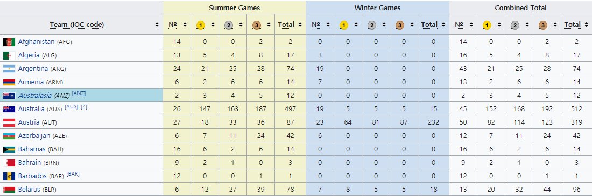
**그림 15-2**위키피디아 페이지에서 제공하는 국가별 하계 및 동계 올림픽 메달 획득 결과

웹 브라우저의 주소 창에서 이 페이지의 주소를 복사한 후, 다음과 같이 코드를 작성합니다.
```python
    import pandas as pd
    df = pd.read_html('http://en.wikipedia.org/wiki/All-time_Olympic_Games_medal_table')
    print(df)
```

pandas는 pd라는 별명을 주로 사용합니다. 그리고 read_html() 함수는 웹 페이지에서 테이블 형태의 데이터를 추출하는 함수입니다. 여기에서는 위키피디아 페이지에 있는 테이블 데이터를 추출해서 df라는 변수에 저장합니다. 코드를 실행하면 인터넷에서 데이터를 읽어오는 데 시간이 조금 걸립니다.

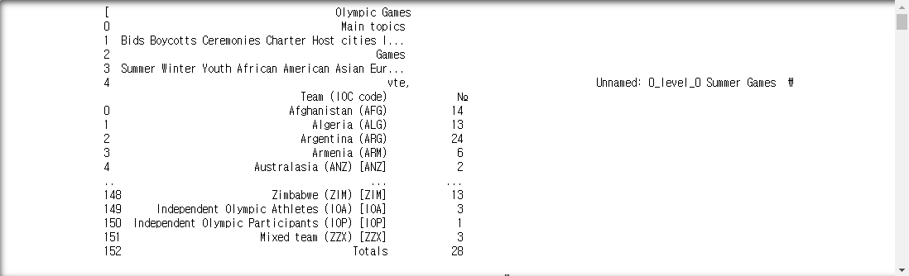
**그림 15-3**위키피디아의 올림픽 메달 표를 읽어온 결과

실행 결과를 보니 뭔가 복잡해 보입니다. 국가별로 이름이 나오고 하계 및 동계 올림픽에 대한 내용이 언급되는 걸 보면 웹 페이지의 내용이 잘 불러들여진 것 같은데, 정확하게 데이터가 어떻게 구성되어 있는지 파악하기가 조금 어렵네요.
실행 결과를 보면 대괄호가 있습니다. 그렇다면 우리가 생성한 df에 저장된 데이터는 리스트 형태라는 뜻이겠죠? df 리스트의 1번 인덱스에 저장된 내용이 무엇인지 살펴볼까요?
```python
    import pandas as pd
    df = pd.read_html('http://en.wikipedia.org/wiki/All-time_Olympic_Games_medal_table')
    df[1]
```


**그림 15-4**위키피디아에서 불러온 올림픽 메달 통계

아까 봤던 메달 데이터가 표 형태로 더 깔끔하게 정리된 것을 볼 수 있습니다. 여기서 맨 위 가로줄을 보면 열(column) 이름이 있습니다. 또 맨 왼쪽에는 0부터 시작되는 인덱스(index) 번호가 보이네요. 인덱스는 컴퓨터가 데이터를 구분하기 위해 필요한 것이므로 우리가 볼 때는 궅이 없어도 될 것 같습니다.

👆잠깐만요
**파이썬 설치 환격에 따라 결과가 다를 수 있어요!**

    파이썬 설치 환경에 따라 실행 결과는 조금 다르게 나올 수 있습니다.

가로 줄의 맨 첫 번째 값은 하계올림픽인지 동계올림픽인지에 대한 구분을 주고, 인덱스는 나라 이름으로 바꾸겠습니다.
데이터를 다시 읽어서 맨 위의 헤더를 열 이름으로 정하고, 나라 이름을 인덱스 이름으로 정했습니다.
```python
    import pandas as pd
    df = pd.read_html('http://en.wikipedia.org/wiki/All-time_Olympic_Games_medal_table', header=0, index_col=0)
    df[1]
```


**그림 15-5**열 이름과 인덱스 이름이 적용된 결과

**TIP** 코드 2행에서 콤마(,)를 기준으로 줄 바꿈을 하면, 괄호를 기준으로 자동 들여쓰기가 됩니다. 들여쓰기를 잘 지켜준다면 여러 줄로 코드를 작성하는 것도 가능합니다.

이번에는 데이터 중 하계올림픽에 대한 데이터만 추출하겠습니다. df[1]이라는 데이터에서 앞의 5개 데이터를 슬라이싱하면 됩니다.
```python
    summer = df[1].iloc[:,:5]
    summer
```

코드 3행에서는 iloc 인덱스 방식을 사용하였습니다. iloc는 데이터의 순서에 따라 접근하는 것인데 콤마를 중심으로 앞은 행, 뒤는 열에 점급하는 것입니다.
따라서 iloc[:,:5]는 모든 행에 대해, 앞에서 5개의 열을 슬라이싱하라는 의미이고 그 결과 하계올림픽에 대한 데이터만 남게 됩니다.

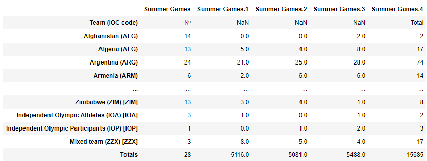
**그림 15-6**하계올림픽 대회 결과만 추출한 모습

그런데 컬럼(열) 이름이 정확하지 않습니다. 그래서 컬럼 이름을 다음과 같이 설정하겠습니다.
```python
    summer.columns = ['경기수', '금', '은', '동', '계']
    print(summer)  
```

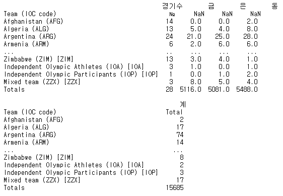
**그림 15-7**칼럼 이름을 지정한 결과

이제 보기 좋은 형태로 정리가 되었네요. 웹 페이지에서 가져온 데이터 그대로 나라 이름은 알파벳순으로 정리되어 있습니다. 이 데이터를 금메달을 기준으로 정렬해볼까요?
sort_values에서 ascending 속성을 변경함으로써 정렬할 수 있습니다. 만약 오름차순으로 정렬하고 싶으면 False를 True 바꾸면 됩니다.
```python
    import pandas as pd
    df = pd.read_html('http://en.wikipedia.org/wiki/All-time_Olympic_Games_medal_table', header=0, index_col=0)
    summer = df[1].iloc[:,:5]
    summer.columns = ['경기수', '금', '은', '동', '계']
    print(summer.sort_values('금', ascending=False))
```

이제 이 표를 엑셀 파일로 저장하겠습니다. 복잡한 과정이 필요할 것 같지만 코드 한 줄이면 충분합니다.
```python
    summer.to_excel('하계올림픽메달.xlsx')
```

코드를 실행시킨 후, 코드 파일이 저장되어 있는 폴더로 가봅시다. 하계올림픽메달.xlsx 파일을 열어보면 금메달 개수를 기준으로 내림차순으로 정렬된 동계올림픽 메달 표를 볼 수 있습니다.

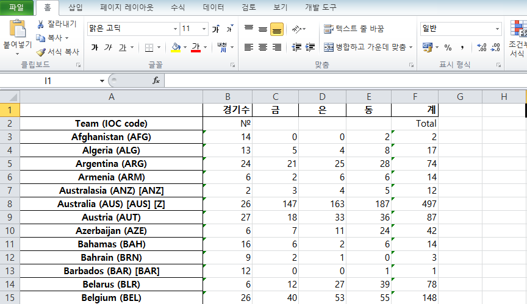
**그림 15-8**하계올림픽 메달 엑셀 파일이 생성

이처럼 pandas 라이브러리를 활용하니 인터넷에 있는 데이터를 쉽게 가져올 수 있습니다. 그뿐만 아니라 컬럼 이름을 '경기수', '금', '은', '동', '계'로 바꾸고, 특정 열(금메달 수)을 기준으로 내림차순 정렬해서 엑셀 파일로 저장까지 했는데 코드가 6줄 밖에 되지 않습니다. import문까지 포함했는데도 말이죠. 놀랍지 않나요? pandas 라이브러리를 활용한 예를 간단히 살펴보았으니 이제 본격적으로 pandas에 대해 알아보겠습니다.

### 2. pandas란

pandas는 panel datas(패널 자료)의 약자로 파이썬을 활용한 데이터 분석에서 가장 많이 활용되는 라이브러리입니다.
Unit 13에 배웠던 numpy를 기반으로 만들어졌으며 데이터 분석을 위한 효율적인 데이터 구조를 제공하는데요. 그중 1차원 배열 형태의 데이터 구조를 Series라고 부르고, 2차원 배열 형태의 데이터 구조를 DataFrame이라고 부릅니다.

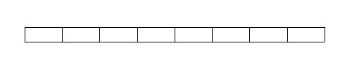
**그림 15-1**1차원 배열 형태: Series

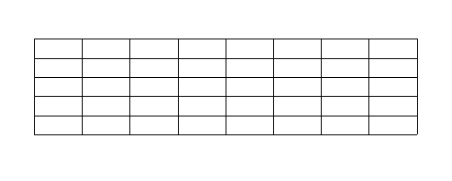
**그림 15-2-2**2차원 배열 형태: DataFrame

이 책에서는 2차원 배열 형태인 DataFrame을 중점적으로 살펴보겠습니다. 사실 조금 전에 올림픽 표를 저장했던 df라는 변수도 DataFrame이라는 뜻으로 사용된 것이었습니다.
이 책에서는 주로 기본 파이썬 문법을 활용해서 많은 문제들을 해결했는데요. 이를 통해 데이터 구조나 데이터를 처리하는 방법에 대해서는 어느 정도 이해했을 것입니다. 이제 여기에 numpy나 pandas 같은 라이브러리를 활용하면 보다 효율적이고 전문적인 데이터 분석을 할 수 있습니다. 이미 만들어진 함수를 활용하기 때문에 코드도 간결해지고요.

### 3. 데이터 프레임 기초

pandas의 가장 기본적인 구조인 DataFrame에 대해 간략히 알아보겠습니다. 2차원 배열 형태의 데이터 프레임은 행과 열이 있고, 행을 구분해주는 인덱스(index)와 열을 구분해주는 컬럼(column)이 있습니다. 그래서 별도로 지정해주지 않으면 인덱스는 리스트처럼 정수로 설정이 되고 한 번 설정된 인덱스는 변경되지 않습니다.
다음과 같이 날짜 형태로 된 8개의 인덱스를 간단히 만들겠습니다.
```python
    import pandas as pd
    index = pd.date_range('1/1/2000', periods=8)
    print(index)
```

    실행 결과: DatetimeIndex(['2000-01-01', '2000-01-02', '2000-01-03', '2000-01-04',
                            '2000-01-05', '2000-01-06', '2000-01-07', '2000-01-08'],
                           dtype='datetime64[ns]', freq='D')

numpy 라이브러리를 활용해서 8행 3열로 구성된 랜덤 데이터를 생성한 후, 인덱스와 컬럼 이름을 정하여 데이터 프레임으로 만들었습니다.
```python
    import numpy as np
    df = pd.DataFrame(np.random.rand(8,3), index=index, columns=list('ABC'))
    df
```

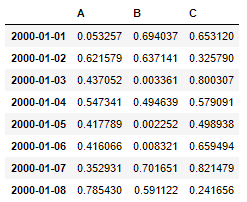
**그림 15-9** 8행 3열짜리 랜덤 데이터 프레임 생성

**TIP** rand() 함수를 사용해서 만든 랜덤 데이터이므로 결과는 책과 다를 것입니다.

데이터 프레임 df의 각 열에 접근하려면 열의 이름을 대괄호 안에 넣으면 됩니다.이때 인덱스는 선택하지 않아도 함께 출력됩니다.
데이터 프레임에서 특정 행이나 열을 선택하면 인덱스와 1차원 배열 형태의 데이터로 이루어진 시리즈(series)라는 데이터 구조 형태로 표현됩니다. 다음 코드를 살펴보면 B라는 이름의 특정 열을 선택하였더니 날짜로 이루어진 인덱스와 1차원 배열 형태(시리즈 형태)로 값이 출력되는 것을 확인할 수 있습니다.

**TIP** 시리즈나 데이터 프레임에 대해 더 알고 싶을 경우 pandas 관련 도서를 참고하세요.

```python
    import pandas as pd
    import numpy as np
    index = pd.date_range('1/1/2000', periods=8)
    df = pd.DataFrame(np.random.rand(8,3), index=index, columns=list('ABC'))
    print(df['B'])
```

    실행 결과:  2000-01-01    0.917794
               2000-01-02    0.364299
               2000-01-03    0.324740
               2000-01-04    0.999028
               2000-01-05    0.415177
               2000-01-06    0.793986
               2000-01-07    0.830685
               2000-01-08    0.254029
               Freq: D, Name: B, dtype: float64

그리고 numpy에서 잠시 봤던 마스크 기능을 데이터 프레임에서도 사용할 수 있습니다. 마스크는 특정한 조건을 만족하는지에 따라 참(True)과 거짓(False)를 반환하여, 우리가 원하는 데이터를 골라내는 데 유용합니다. 예를 들어, B열의 데이터가 0.4보다 큰 지 확인하는 조건을 두어 참과 거짓을 반환할 수 있습니다.
```python
    import pandas as pd
    import numpy as np
    index = pd.date_range('1/1/2000', periods=8)
    df = pd.DataFrame(np.random.rand(8,3), index=index, columns=list('ABC'))
    print(df['B'] > 0.4)
```

    실행 결과:   2000-01-01     True
                2000-01-02     True
                2000-01-03     True
                2000-01-04    False
                2000-01-05     True
                2000-01-06     True
                2000-01-07    False
                2000-01-08    False
                Freq: D, Name: B, dtype: bool

이제 이것을 데이터 프레임에 적용시켜서 다시 저장해볼까요?
B열의 값이 0.4보다 큰 값이라는 조건이 True인 데이터들로만 이루어진 데이터 프레임을 만들겠습니다.
```python
    df2 = df[df['B'] > 0.4]
    df2
```


**그림 15-10** 마스크(B열이 0.4보다 큰)를 적용시킨 데이터 프레임 출력 결과

만약 행과 열의 데이터를 뒤집으려면 어떻게 해야 할까요? 아주 간단하게 데이터 프레임에 .T만 붙여주면 행과 열을 바꿀 수 있습니다.

**TIP** T는 행과 열을 바꾼다는 의미의 단어 transpose를 의미합니다.

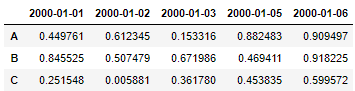
**그림 15-11** 행과 열을 바꾼 데이터 프레임

이번에는 2차원 배열 형태의 데이터 프레임 연산에 대해 살펴보겠습니다. 2차원 데이터는 행을 기준으로 계산할 수도 있고, 열(column)을 기준으로 계산할 수도 있습니다. 또 행과 열에 대한 연산을 동시에 할 때, 행 우선 계산과 열 우선 계산을 구분하여 생각해 볼 수 있습니다.

👆잠깐만요
**데이터 프레임의 행 우선 계산과 열 우선 계산**

    2차원 데이터일 경우 pandas에서는 기본적으로 행 방향을 축으로 계산합니다. 하지만 경우에 따라 열 방향을 축으로 계산하기도 합니다. 이때 열 방향을 축으로 계산하려면 axis를 1로 설정하면 됩니다(axis=0은 행 방향을 나타내며 0기 기본 값입니다).
    일반적으로 행렬이라는 단어를 자주 사용하므로 axis가 0이면 행 방향, axis가 1이면 열 방향을 축으로 삼아 계산한다고 기억하면 좋습니다.
    예를 들어 설명하겠습니다. 다음과 같은 df라는 데이터 프레임이 있습니다. 여기에서 A, B, C, D열의 값을 합ㅇ하여 E라는 열을 만들어보겠습니다.

|      |   A   |   B   |   C   |   D   |
|---|---|---|---|---|
|**1**|0|1|2|3|

    이때 열방향을 축으로 값을 더해야하기 때문에 axis를 1로 설정해야 합니다. 그래서 df['E'] = np.sum(df.axis=1)라는 코드를 실행하면 다으모가 같이 E열이 추가됩니다.

|      |   A   |   B   |   C   |   D   |   E   |
|---|---|---|---|---|---|
|**1**|0|1|2|3|6|

    사실 이것은 numpy의 기능인데 pandas에서도 동일하게 적용됩니다.

먼저 행 방향 축을 기준으로 한 연산에 대해 알아보겠습니다.
전체 행에 대해서 A열의 값을 B열의 값으로 나눈 후, 그 결과를 새로 만든 D열에 저장한다면, 다음과 같이 간단하게 코드를 작성할 수 있습니다.
```python
    import pandas as pd
    import numpy as np
    index = pd.date_range('1/1/2000', periods=8)
    df = pd.DataFrame(np.random.rand(8,3), index=index, columns=list('ABC'))
    df['D'] = df['A'] / df["B"]  # A열의 값을 B열의 값으로 나눈 값을 D열에 저장
    df
```


**그림 15-12 ** 행 방향 축 연산 결과

간단하죠? 다음은 열 방향 축을 기준으로 계산하는 예를 살펴보겠습니다.
다음 코드는 df 데이터 프레임에서 행 우선으로 합을 구하고, 그 결과를 E라는 열을 생성해서 저장하는 코드입니다. head() 함수는 많은 데이터 중 처음 5개의 데이터만 확인하고 싶을 때 사용하는 함수로, 많은 양의 데이터의 형태를 확인할 때 유용합니다.

```python
    import pandas as pd
    import numpy as np

    index = pd.date_range('1/1/2000', periods=8)
    df = pd.DataFrame(np.random.rand(8,3), index=index, columns=list('ABC'))
    df['D'] = df['A'] / df["B"]
    df['E'] = np.sum(df, axis=1)  # 행 우선 계산 값을 E열에 저장
    df.head()
```


**그림 15-13** 행 우선 연산 결과를 E열에 나타낸 결과

다음은 전체 데이터에 대해서 열 우선 계산을 하는 방법입니다.
아까는 1개의 열을 1개의 열로 나누는 계산이었기 때문에 산술 연산자를 사용할 수 있었지만 여러 개의 열에 대한 계산을 하려면 pandas 라이브러리를 사용해야 합니다.
예를 들어 전체 데이터를 A열의 값으로 뺄 때는 sub() 함수를 사용합니다.

```python
    import pandas as pd
    import numpy as np

    index = pd.date_range('1/1/2000', periods=8)
    df = pd.DataFrame(np.random.rand(8,3), index=index, columns=list('ABC'))
    df['D'] = df['A'] / df["B"]
    df['E'] = np.sum(df, axis=1)
    df = df.sub(df['A'], axis=0)  # A열의 데이터를 기준으로 열 우선 계산
    df.head()
```

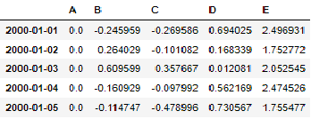
**그림 15-14** A 열을 기준으로 열 우선 계산(뺄셈)을 한 결과

A열 값을 기준으로 전체 데이터에 대한 뺄셈이 이루어졌기 때문에 A열 값은 모두 0이 되며, B열 값도 기존의 값에서 A열 값만큼 뺀 값이 저장된 것을 확인할 수 있습니다.
데이터 전체를 C열 값으로 나눌 때는 div() 함수를 사용합니다. 그리고 데이터 프레임을 CSV 파일로도 쉽게 저장할 수도 있습니다.

```python
    import pandas as pd
    import numpy as np

    index = pd.date_range('1/1/2000', periods=8)
    df = pd.DataFrame(np.random.rand(8,3), index=index, columns=list('ABC'))
    df['D'] = df['A'] / df["B"]
    df['E'] = np.sum(df, axis=1)
    df = df.sub(df['A'], axis=0)
    df = df.div(df['C'], axis=0)   # C열 데이터를 기준으로 열 우선 계산
    df.to_csv('test.csv')          # 데이터 프레임을 test.csv 파일로 저장
    df.head()
```

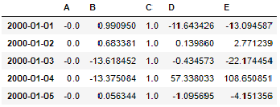
**그림 15-15** 데이터 전체를 C열 값으로 나눈 결과

코드가 저장된 폴더에 가면 test.csv 파일이 생겼을 것입니다. 클릭해서 열어보세요.

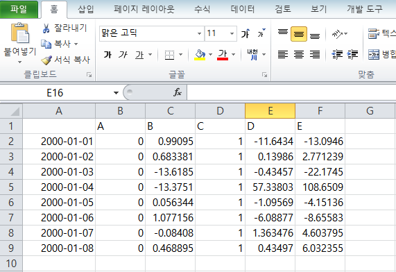
**그림 15-16** 데이터 프레임을 CSV 파일로 저장할 수 있음

### 4. pandas로 인구 구조 분석하기

지금까지 pandas 라이브러리 사용법을 살펴보았습니다. 이제 Unit 14에서 파이썬 기본 문법과 numpy 라이브러리를 활용해서 만들었던 데이터 프로젝트를 pandas 라이브러리로 구현해 보겠습니다. 알고리즘은 Unit 14에서 작성했던 것을 그대로 가져왔습니다.

**1**| 데이터를 읽어온다.

**1**. 전체 데이터를 총 인구수로 나누어 비율로 변환한다.

**2**. 총인구수와 연령구간인구수를 삭제한다.

**2**| 궁금한 지역의 이름을 입력받는다.

**3**| 궁금한 지역의 인구 구조를 저장한다.

**4**| 궁금한 지역의 인구 구조와 가장 비슷한 인구 구조를 가진 지역을 찾는다.

**1**. 전국의 모든 지역 중 한 곳(B)을 선택한다.

**2**. 궁금한 지역 A의 0세 인구 비율에서 B의 0세 인구 비율을 뺀다.

**3**. **2**를 100세 이상 인구수에 해당하는 값까지 반복한 후 차이의 제곱을 모두 더한다.

**4**. 전국의 모든 지역에 대해 반복하며 그 차이가 가장 작은 지역을 찾는다.

**5**| 가장 비슷한 곳의 인구 구조와 궁금한 지역의 인구 구조를 시각화한다.

* **1**| **데이터 읽어오기**

먼저 데이터를 읽어옵니다. 지금까지는 csv 라이브러리를 사용했지만 pandas에서는 read_csv() 함수를 활용하면 됩니다. 지금까지의 방법과 다른 점은 인코딩 방식을 작성한다는 것인데요. 윈도에서 만든 csv 파일일 경우 encoding에 cp949라고 작성합니다. Unit 14에서 사용했던 age.csv 파일이 있는 폴더에 다음 코드를 저장하여 실행합니다.
```python
    import pandas as pd
    df = pd.read_csv('age.csv', encoding='cp949', index_col=0)
    df.head()
```

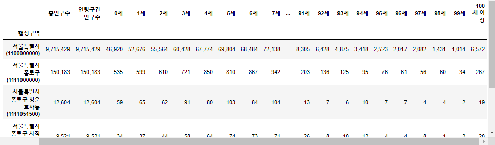
**그림 15-17** age.csv를 읽어온 결과

그리고 연령별 인구 숫자를 비율로 바꿔주고 총인구수와 연령구간인구수 데이터를 삭제합니다. 특정 열을 삭제를 할 때는 다음과 같이 del 명령을 사용하면 됩니다.
```python
    import pandas as pd
    df = pd.read_csv('age.csv', encoding='cp949', index_col=0)
    df = df.div(df['총인구수'], axis=0) # 전체 데이터를 총 인구수로 나눠서 비율로 변환
    del df['총인구수'], df['연령구간인구수'] # 총인구수, 연령구간인구수 열 삭제
```

**TIP** 만약 오류가 나왔다면 코드의 열 이름과 age.csv 파일의 열 이름이 같은지 확인하세요. 예를 들어 age.csv 파일의 열 이름이 '총인구수'가 아니라 '2019년02월_계_총인구수'라면 코드를 변경하거나, csv 파일 내 열 이름을 변경해야 합니다.

* **2~3**| **궁금한 지역 이름 입력받고 해당 지역의 인구 구조 저장하기**

input() 함수로 알고자 하는 지역의 이름을 입력받고 해당 지역의 인구 구조를 저장합니다. df.index.str.contains() 함수는 데이터 프레임의 인덱스 문자열에 원하는 문자열이 포함된 행을 찾아냅니다.
```python
    name = input('원하는 지역의 이름을 입력해주세요 : ') # 지역 이름 입력
    a = df.index.str.contains(name) # 해당 행을 찾아서 해당 지역의 인구 구조를 저장
    df2 = df[a]
    df2
```

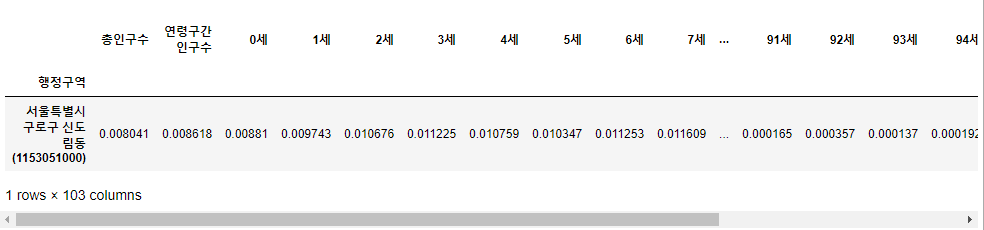
**그림 15-18**신도림동의 인구 구조를 출력한 결과

데이터를 그래프로 그리려면 행과 열을 바꾼 후 plot() 함수를 실행하면 됩니다.
```python
    import matplotlib.pyplot as plt
    plt.rc('font', family='Malgun Gothic')
    df2.T.plot()
    plt.show()
```


**그림 15-19** 신도림동의 인구 구조를 그래프로 나타낸 결과

* **4~5**| **궁금한 지역의 인구 구조와 가장 비슷한 인구 구조를 가진 지역 시각화하기**

이제 데이터를 처리하는 가장 중요한 부분입니다. 여기에서는 각 알고리즘 코드를 개별로 살펴본 후, 마지막에 전체 코드를 실행하여 결과를 확인하겠습니다.
먼저 궁금한 지역의 연령별 비율과 다른 지역의 연령별 비율의 차이를 계산합니다. 그리고 궁금한 지역의 연령별 비율과 다른 지역의 연령별 비율의 차이를 계산합니다.
```python
    import numpy as np # 1. 궁금한 지역 A의 인구 비율에서 B의 인구 비율을 뺀다.
    x = df.sub(df2.iloc[0], axis=1) # 2. A의 인구 비율에서 B의 인구 비율을 뺀 값의 제곱 값을 모두 더한다.
    y = np.power(x, 2)
    z = y.sum(axis=1)
```

Unit 14에서는 궁금한 지역의 연령별 비율과 다른 지역의 연령별 비율의 차이를 계산하여 가장 차이가 작은 지역 한 곳을 찾았습니다. 예를 들어, '신도림동'을 입력하면 '서울특별시 구로구 구로제1동' 한 곳의 결과만 볼 수 있었습니다. 하지만 pandas의 sort_values() 정렬 함수와 슬라이싱을 이용하면 상위 몇 개 지역까지 쉽게 찾을 수 있습니다.
```python
    i = z.sort_values().index[:5]  # 3. 그 차이가 가장 작은 지역 5곳을 찾는다.
```

이제 결과를 꺾은선 그래프로 그려주면 이렇게 표현됩니다.
```python
    df.loc[i].T.plot()   # 4. 3 결과를 꺾은선 그래프로 보여준다
    plt.show()
```

지금가지 내용을 정리하면 다음과 같습니다.
```python
    import numpy as np # 1. 궁금한 지역 A의 인구 비율에서 B의 인구 비율을 뺀다.
    x = df.sub(df2.iloc[0], axis=1) # 2. A의 인구 비율에서 B의 인구 비율을 뺀 값의 제곱 값을 모두 더한다.
    y = np.power(x, 2)
    z = y.sum(axis=1)
    i = z.sort_values().index[:5]  # 3. 그 차이가 가장 작은 지역 5곳을 찾는다.
    df.loc[i].T.plot()   # 4. 3 결과를 꺾은선 그래프로 보여준다
```

이처럼 4| 과정에 해당하는 코드를 이해하기 쉽게 다섯 줄로 작성하였지만, 다음과 같이 한 줄로 줄일 수도 있습니다.
```python
    #4| 궁금한 지역의 인구 구조와 가장 비슷한 인구 구조를 가진 지역 찾기
    df.loc[np.power(df.sub(df2.iloc[0], axis=1), 2).sum(axis=1).sort_values().index[:5]].T.plot()
```

그리고 이를 전체 코드로 나타내면 다음과 같습니다.

### 우리 동네와 인구 구조와 비슷한 지역들을 그래프로 나타내기(pandas 사용)
```python
    import pandas as pd
    import numpy as np
    import matplotlib.pyplot as plt

    plt.rc('font', family='Malgun Gothic')
    df = pd.read_csv('age.csv', encoding='cp949', index_col=0)
    df = df.div(df['총인구수'], axis=0)
    del df['총인구수'], df['연령구간인구수']

    name = input('원하는 지역의 이름을 입력해주세요 : ')
    a = df.index.str.contains(name)
    df2 = df[a]
    df.loc[np.power(df.sub(df2.iloc[0], axis=1), 2).sum(axis=1).sort_values().index[:5]].T.plot()

    plt.show()
```

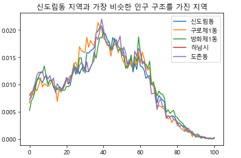
**그림 15-20**신도림동의 인구 구조와 비슷한 지역들을 그래프로 나타낸 결과

결국 이 프로젝트를 pandas로 작성한 코드는 import 구문 위 세 줄을 포함해서 12줄 밖에 되지 않습니다. 물론 pandas를 더 깊이 이해하려면 많은 노력이 필요합니다. 하지만 이 책에서는 이렇게 간단하게 데이터를 분석할 수 있다는 점을 보여주고 싶었습니다. 이를 계기로 pandas에 매력을 느꼈거나 더 배워야겠다는 생각이 들었다면 <모두의 데이터 과학 with 파이썬(길벗, 2017)>과 같이 전문적인 책을 통해 더 깊이 있는 내용을 배울 것을 권장합니다.