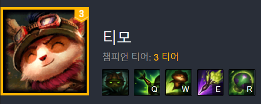
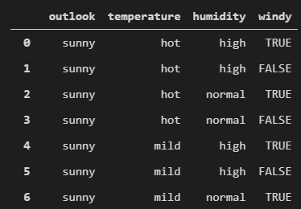
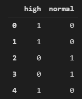
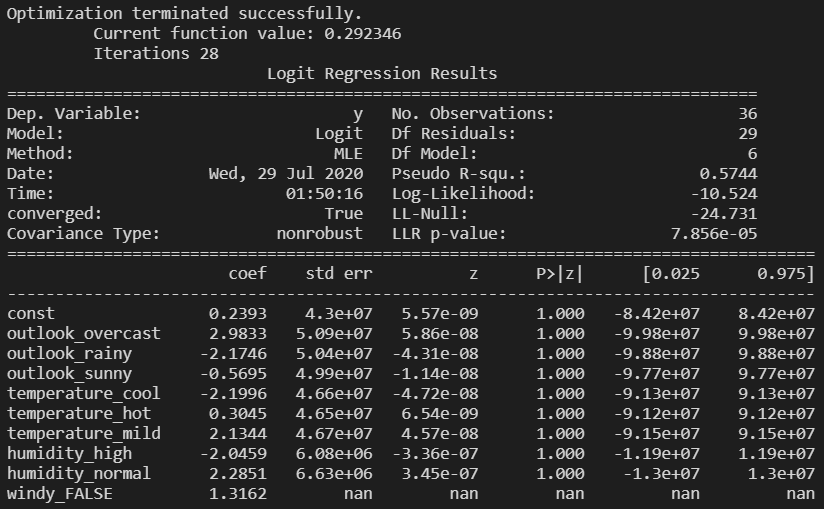
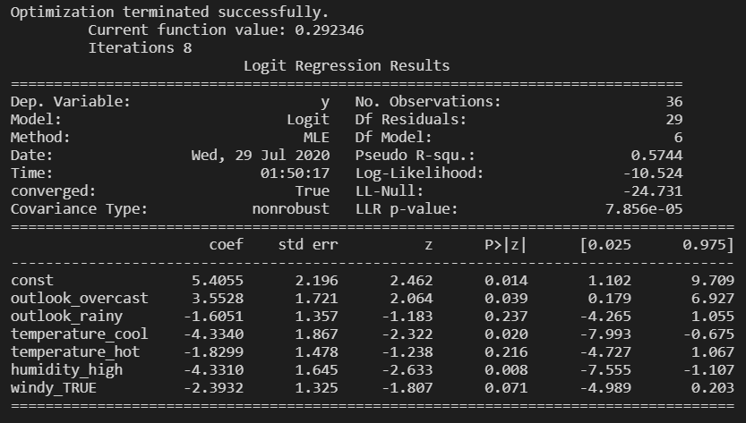
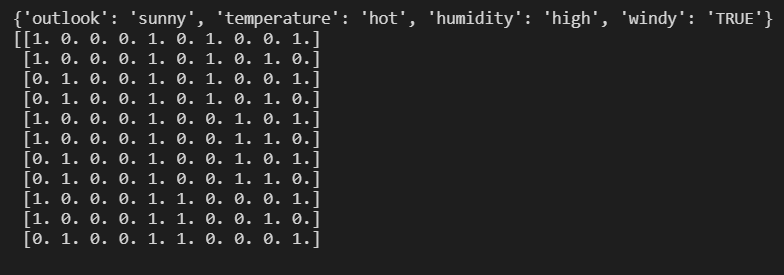
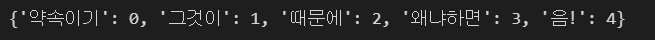
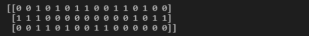
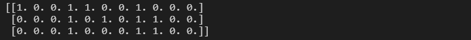
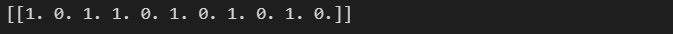

# 2. 정성적 특성 인코딩 (Data Discretization)
이번 파트를 들어가기 앞서, 정성적과 정량적에 대한 개념부터 잡고 가겠습니다.  
* 정성적(qualatative) : 자료를 묘사, 풀어씀
* 정량적(quantitive) : 자료를 수치화함

예를 들어  
**티모는 전설이다..** 라는 데이터는 정성적 데이터지만   
**티모는 3티어 챔피언이다**는 정량적 데이터인 셈이죠.  
  
그런데 저희가 필요한 데이터를 받았더니 정성적 데이터라면 어떻게 회귀분석을 진행할 수 있을까요?  
## 데이터 준비
```python
outlook = ['sunny', 'overcast', 'rainy']
temperature = ['hot', 'mild', 'cool']
humidity = ['high', 'normal']
windy = ['TRUE', 'FALSE']

weather_dataset = list()

for o in outlook : 
    for t in temperature : 
        for h in humidity : 
            for w in windy : 
                weather_dataset.append([o,t,h,w])
                
play = [0,0,1,1,1,0,1,1,0,0,0,1,1,1,1,1,1,1,1,1,0,0,1,1,0,0,0,1,0,1,0,1,0,0,0,1]
```
위와 비슷한 문제입니다. 기상청에서 제공하는 이쁜 데이터(온도 20도, 습도 10%..)가 아니라 꼬꼬마 애기들이 쓴 그림일기에서 날씨 데이터(날씨 맑음, 더움, 습함, 바람 붐)를 얻어온다고 해봅시다. 이거 가지고 어떻게 회귀분석을 할 수 있을까요?  
　    
## Pandas를 이용한 더미 코딩
가장 쉽게 생각할 수 있는 방법은, 그냥 차례대로 숫자를 대입하는 겁니다. 맑음=1, 더움=2, 습함=3 이렇게요. 하지만 이 방법을 그대로 사용하면 서로간에 관계가 생기게 됩니다. *맑음+더움=습함* 이렇게요! 사실 서로간의 관계가 전혀 없음에도 불구하고 말이죠. 그래서 **더미(dummy)로 가변수화** 시켜주는 과정이 필요합니다.
Pandas에서는 `pandas.get_dummies` 메소드를 제공합니다. 
### 1. Pandas 데이터 프레임을 생성합니다.
```python
import pandas as pd
df = pd.DataFrame(weather_dataset, columns=['outlook', 'temperature', 'humidity', 'windy'])
df
```
  
### 2. pd.get_dummies 메소드로 더미값을 생성합니다.
```python
print(pd.get_dummies(df.humidity).iloc[:5,:])
dummy_encoding = pd.get_dummies(df)
```
  
### 3. 생성된 더미값들은 바로 회귀분석에 사용할 수 있습니다.
```python
import statsmodels.api as sm
X = sm.add_constant(dummy_encoding)
logit = sm.Logit(play, X)
result = logit.fit()
print(result.summary())
```
  
### 4. 다중공선성을 제거하기 위해 일부 더미값을 제외합니다.
```python
X.drop(['outlook_sunny', 'temperature_mild',
        'humidity_normal', 'windy_FALSE'], inplace=True, axis=1)
logit = sm.Logit(play, X)
result = logit.fit()
print(result.summary())
```
  
(제거된 더미값들은 절편(const)로 통합됩니다.)
### 단점
더미 가변수화는 데이터가 들어올 때 마다 가변수화를 진행하기 때문에 같은 종류인데 다르게 가변수화가 진행되어서 이상한 데이터셋이 생성될 수 있다는 한계가 존재합니다.  
[참고 블로그 - get_dummies](https://devuna.tistory.com/67)   
　    
## DictVectorizer, one-hot encoding  
get_dummies의 한계를 극복하기 위해 Scikit-learn에서 제공하는 DictVectorizer를 사용해봅시다.  
DictVectorizer 클래스는 Dictionary로 구성된 데이터셋을 읽어 정성적 데이터는 이진화, 숫자 데이터는 그대로 유지합니다(정성적 데이터가 이미 이진화 되어있으면 다시 정성적 데이터로 복원 후 진행).  
```python
from sklearn.feature_extraction import DictVectorizer
vectorizer = DictVectorizer(sparse=False)
dict_representation = [{varname:var for var, varname in zip(
                        row,['outlook', 'temperature','humidity','windy'])}
                        for row in weather_dataset]
print(dict_representation[0])
print(vectorizer.fit_transform(dict_representation))
```  
  
위에서 보는 것과 같이, 모든 경우의 수에 대해 Dictionary Key를 생성합니다. 그리고 Key가 일치하는 항목에 대해서만 데이터를 출력합니다.  
이 방법은 메모리는 많이 잡아먹지만, Dictionary가 생성되고 나서도 같은 데이터에 대해 다른 샘플을 적용할 수 있다는 점에서 **get_dummies의 한계를 극복**했다고 볼 수 있습니다.

### 시각화
```python
>>> vectorizer.feature_names_ 

''' <output>
['humidity=high', 'humidity=normal',
 'outlook=overcast', 'outlook=rainy', 'outlook=sunny', 
 'temperature=cool', 'temperature=hot', 'temperature=mild', 
 'windy=FALSE', 'windy=TRUE']
'''
```
### LabelEncoder
```python
from sklearn.preprocessing import LabelEncoder, LabelBinarizer
label_encoder = LabelEncoder()
print(label_encoder.fit_transform(df.outlook))

''' <output>
[2 2 2 2 2 2 2 2 2 2 2 2 0 0 0 0 0 0 0 0 0 0 0 0 1 1 1 1 1 1 1 1 1 1 1 1]
'''
```
LabelEncoder 메소드는 정성적 데이터를 숫자로 인코딩해주는 착한 친구입니다. outlook 클래스에는 overcast, rainy, sunny의 세종류가 있는데 이를 이쁘게 숫자로 바꿔줍니다.  
(새로운 샘플에 대한 일관성은 fit_transform함수에서 보장해준다고 해요).  
```python
>>> print(label_encoder.inverse_transform([0,1,2]))
>>> print(label_encoder.classes_)

''' <output>
['overcast' 'rainy' 'sunny']
['overcast' 'rainy' 'sunny']
'''
```
역변환을 통해 인코딩된 결과가 원래 어떤 데이터였는지, 혹은 classes_를 사용해 내부 변수를 확인할 수 있습니다.  
### LabelBinarizer
**LabelBinarizer 메소드**는 정량적 데이터를 이진화해주는 친구입니다.
```python
label_binarizer = LabelBinarizer(neg_label=0, pos_label=1,sparse_output=False)
print(label_binarizer.fit_transform(label_encoder.fit_transform(df.outlook)))

''' <output>
[[0 0 1]
 [0 0 1]
 ...
 [1 0 0]
 [1 0 0]
 ...
 [0 1 0]
 [0 1 0]
'''

```
이 친구는 희소 표현을 사용하기 때문에 책에서는 메모리를 절약할 수 있다고 하네요.  
[(희소표현은 메모리 효율성에 있어서 굉장히 비효율적인 방법인데...?)](https://sikaleo.tistory.com/11)  
　    
## 특성 해셔(hasher)
### One-hot encoding
어떤 종류의 데이터라 해도 이진변수만을 사용해 표현할 수 있도록 하는 변환방법입니다. BoW(Bag of words) 기법(공백을 기준으로 나눔)을 사용해 단어 단위로 나누게 됩니다.
```python
your_text = '왜냐하면 그것이 약속이기 때문에 음!'
mapping_words_in_text = {word:position for position, word in
                        enumerate(set(your_text.lower().split(' ')))}
print(mapping_words_in_text)
```
  
### CountVectorizer
scikit-learn에서는 해당 이진변환을 자동으로 해주는 메소드를 제공합니다.  
```python
corpus = ['The Quick fox jumped over the lazy dog',
          'I sought a dog wondering around with a bird',
          'My dog is named Fido']

from sklearn.feature_extraction.text import CountVectorizer
textual_one_hot_encoder = CountVectorizer(binary=True)
textual_one_hot_encoder.fit(corpus)
vectorized_text = textual_one_hot_encoder.transform(corpus)
print(vectorized_text.todense())
```

### Hashing Trick
그런데, 이전에 없었던 샘플이 등장하면 어떻게 될까요?
```python
print(textual_one_hot_encoder.transform(['John went home today']).todense())
```
  
당연히 한번도 나온적 없는 단어니까 인코딩이 제대로 될 수 없을겁니다. 그래서 처음부터 엄청 큰 희소 행렬을 정의하고, 새로운 샘플이 나올 때 마다 해쉬함수를 거쳐서 나온 해쉬에 단어를 저장하는 겁니다. 이를 Hasing Trick이라고 합니다.  
```python
# non_negative -> alternate_sign
from sklearn.feature_extraction.text import HashingVectorizer
hashing_trick = HashingVectorizer(n_features=11, binary=True,
                                 norm=None, alternate_sign=True)
M = hashing_trick.transform(corpus)
print(M.todense())
```
  
이렇게 하면 새로운 샘플이 등장해도 당황하지 않고 인코딩을 이어나갈 수 있겠죠?  
```python
print(hashing_trick.transform(['John is the owner of that dog']).todense())
```
