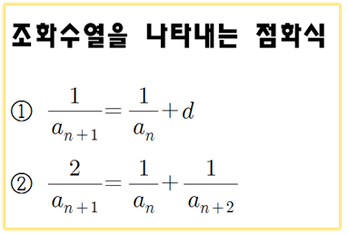
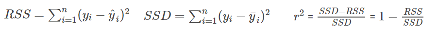
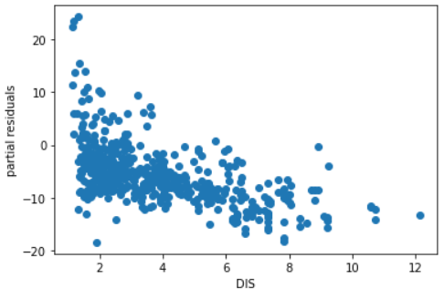
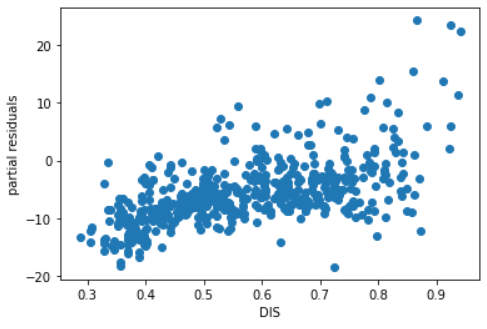

# 3. 수치특성변환 (Feature Engineering)
수치특성변환은 R제곱, 잔차 값들을 보고 비선형성을 파악하여 이를 제거하기 위해 데이터에 수식적 변형을 가하는 방법입니다.  
쉽게 말해서 여러분들 순열 공부할 때 a1,a2,a3이 아무리해도 규칙이 안나오는데 역수 취하면 바로 보이는 애들 있죠? 기억나시죠 조화수열?  
  
아무리봐도 비선형성 가지고 있는 것 같을 때 수식으로 이렇게 저렇게 변형해보는 방법이라는 겁니다.  
차례대로 알아봅시다.
## 데이터셋 준비 
```python
import numpy as np
boston = load_boston()
labels = boston.feature_names
X = boston.data
y = boston.target
print(boston.feature_names)
```
```
['CRIM' 'ZN' 'INDUS' 'CHAS' 'NOX' 'RM' 'AGE' 'DIS' 'RAD' 'TAX' 'PTRATIO' 'B' 'LSTAT']
```

## R-Squared(R제곱)
R제곱 값은 다음과 같이 정의됩니다.

잔차제곱합(RSS)은 예측값과 실제값 사이의 괴리를 나타내는 잔차(Residual)를 제곱한 값입니다.   
**예측을 제대로 할 수록 RSS값이 작아지고, 이는 회귀선이 모든 자료를 잘 설명하고 있다는 뜻이 됩니다.**  
편차제곱합(SSD)는 사실 RSS를 설명하기 위해 사용한거라 큰 의미는 없습니다.  
실제로 R2값을 구해봅시다.
```python
from sklearn.metrics import r2_score
linear_regression = linear_model.LinearRegression(fit_intercept=True)
linear_regression.fit(X,y)
print("R-squared  %0.3f" % r2_score(y, linear_regression.predict(X)))
```
```
R-squared  0.741
```
## Residual(잔차)
잔차를 구하기는 쉽숩니다. 실제값에서 예측값을 빼기만 하면 되죠.
```python
residuals = y - linear_regression.predict(X)
print("Head of residual : %s" % residuals[:5])
print("Mean of residual : %0.3f" % np.mean(residuals))
print("Standard deviation of residuals : %0.3f" % np.std(residuals))
```
```
Head of residual : [-6.00384 -3.42556  4.1324   4.79296  8.25648]
Mean of residual : 0.000
Standard deviation of residuals : 4.679
```
잔차들의 분포를 분석해서 얻을 수 있는 정보도 있습니다. 회귀분석이 미처 예측하지 못한 내용을 말해주고 비정상적인 관찰과 비선형성에 대한 통찰력도 제공해주죠.   
비선형성을 감지하기 위해 잔차로 이루어진 플롯을 띄워봅시다.
```python
var = 7
partial_residual = residual + X[:, var] * linear_regression.coef_[var]
plt.plot(X[:,var], partial_residual, 'o')
plt.xlabel(boston.feature_names[var])
plt.ylabel('partial residuals')
plt.show()
```
  
위의 결과를 보면, DIS(5개의 보스턴 직업센터까지의 접근성 지수)의 경우 잔차들이 2점을 지나고 나서부터 꺽이는 듯한 경향을 보입니다. 이는 명백한 **비선형성의 증거**이므로 R2값을 그대로 계산하면 안됩니다.
### 역제곱 변환
```python
X_t = X.copy()
X_t[:,var] = 1./np.sqrt(X_t[:,var])
linear_regression.fit(X_t,y)
linear_residual = residuals + X_t[:,var] * linear_regression.coef_[var]
plt.plot(X_t[:,var], partial_residual, 'o')
plt.xlabel(boston.feature_names[var])
plt.ylabel('partial residuals')
plt.show()
print("R-squared : %0.3f" %r2_score(y, linear_regression.predict(X_t)))
```
```
R-squared : 0.769
```
  
역제곱변환을 이용해서 Fitting을 한 결과입니다. 아까보다 R제곱값이 더욱 올라간 것을 확인할 수 있습니다.  
역제곱변환 뿐만아니라 다른 방법들 또한 시도해볼만한 가치가 있습니다.  
-> 로그, 지수제곱, 제곱, 세제곱, 제곱근, 세제곱근, 역변환

## Binning(비닝)
빈,빈,빈.. 책에서는 빈이라고 적어놨는데 그냥 Binary 애칭이라고 보시면 됩니다. Binary는 이진이죠. 그럼 비닝방법은 이진화라고 보시면 됩니다. 정확하게는 양자화(Quantization), 더 나아가 이산화(Discretization)가 조금 더 맞는 표현이겠네요.  
연속적인 데이터를 이산적인 데이터로 바꿔서 각각의 부분에 대해서만 이쁘게 Fitting하는 겁니다.
```python
import numpy as np
from sklearn.preprocessing import LabelBinarizer
LB = LabelBinarizer()
X_t = X.copy()
edges = np.histogram(X_t[:,var], bins=20)[1]
binning = np.digitize(X_t[:,var], edges)
X_t = np.column_stack((np.delete(X_t, var, axis=1),LB.fit_transform(binning)))
linear_regression.fit(X_t,y)
print("R-squared : %0.3f" %r2_score(y, linear_regression.predict(X_t)))
```
```
R-squared : 0.768
```
물론 이렇게하면 R^2값은 올라갈 수 있겠지만 한번도 보지못한 경우를 배재해버리기 때문에 데이터가 충분하지 않다면 과적합(Overfitting) 문제가 발생할 수 있습니다.
