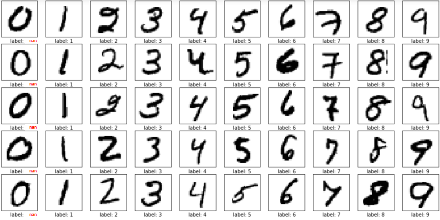

# 4. 누락데이터 (Missing value treatment)

데이터 수집 또는 데이터 전처리과정에서 누락된 데이터를 처리하는 방법입니다. 

## 데이터 수집 과정에서 누락된 경우
```python
import numpy as np
example = np.array([1,2,np.nan,4,5])
print(example)
print(np.isnan(example))
print(np.nan_to_num(example))
```
```
[ 1.  2. nan  4.  5.]
[False False  True False False]
[1. 2. 0. 4. 5.]
```
첫번째와 같이 누락된 데이터가 있다고 가정했을 때, 해당 값을 명시적으로 처리해주는 과정을 거치게 됩니다.  
```python
missing = np.isnan(example)
replacing_value = np.mean(example[~missing])
example[missing] = replacing_value
print(example)
```
```
[1. 2. 3. 4. 5.]
```
그저 0으로 대체하기보다는 평균을 취하는 방법이 조금 더 정교하겠죠?  

## SimpleImputer
그런데 데이터 샘플이 들어올 때마다 다른 방법을 취하게 된다면 일관성이 떨어지겠죠?  
누락데이터를 처리하는데 특화된 SimpleImputer 메소드를 사용해봅시다.

### 누락데이터 만들기
```python
from random import sample, seed
import numpy as np
seed(19)
Xm = X.copy()
missing = sample(range(len(y)), len(y)//4)
Xm[missing,5] = np.nan
print("Header of Xm[:,5] : %s" % Xm[:10,5])
```
```
Header of Xm[:,5]
: [ 6.575, nan, 7.185, nan, 7.147, 6.43, 6.012, 6.172, nan, 6.004 ]
```

### 누락데이터 처리하기
```python
from sklearn.impute import SimpleImputer
from sklearn.preprocessing import FunctionTransformer
print(Xm.shape)
impute = SimpleImputer(missing_values = np.nan, strategy='mean')
imputed_X = impute.fit_transform(Xm.T).T
print("Header of imputed Xm[:,5] : %s" % imputed_X[:,5][:10])
```
```
(506, 13)
Header of imputed Xm[:,5]
: [ 6.575, 63.27278, 7.185, 57.98355, 7.147, 6.43,
    6.012, 6.172, 72.91228, 6.004 ]
```
윗 경우처럼 직접 평균을 구하는 코드를 짤 필요 없이, SimpleImputer 하나로 모든 데이터 샘플에 대하여 같은 작업을 취합니다.  

### 누락데이터에 특별한 의미가 있다고 판단되는 경우
  
누락데이터가 만약에 특별한 의미를 가지고 있다면, 평균으로 보내면 큰일나겠죠? 예를 들어 숫자 1~9 사진 데이터셋에 0이 누락되어 있을 때, 이 값을 평균으로 보내면 회귀분석은 얘를 대충 4나 5라고 인식하겠죠. 근데 누락값이라는 어떠한 표시를 해놓는다면,  
**이게 뭔데ㅋㅋ 근데 표시를 해놓은 놈들은 다 동그랗네ㅋㅋㅋ**  
라고 알 수 있는거죠. 이 표시는 이진화를 사용합니다.
```python
missing_indicator = np.isnan(Xm[:,5]).astype(int)
print("Header of missing indicator : %s" %missing_indicator[:10])
```
```
Header of missing indicator : [0 1 0 1 0 0 0 0 1 0]
```
