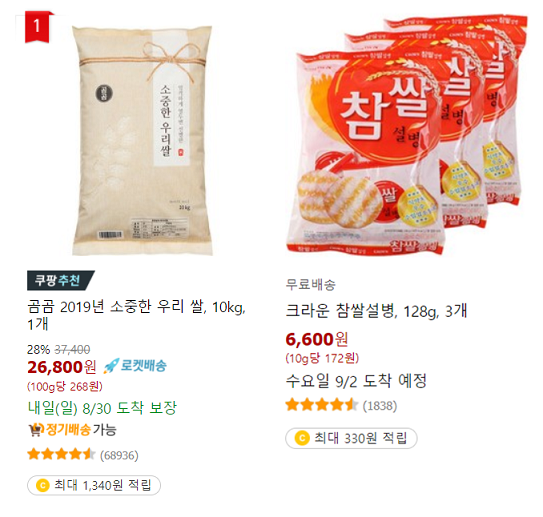
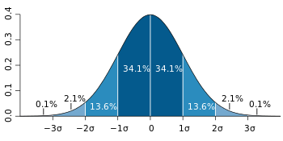
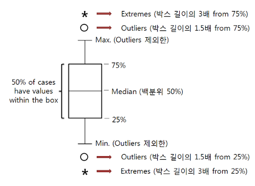
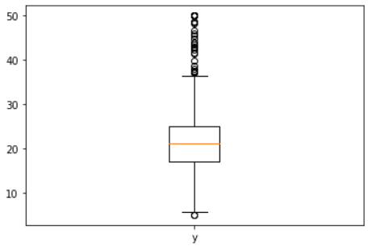
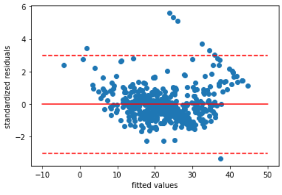
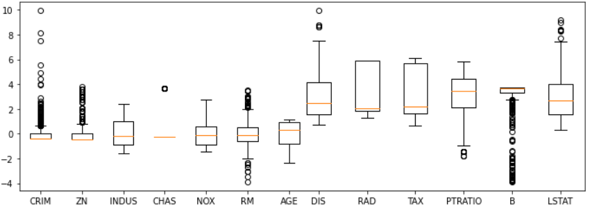
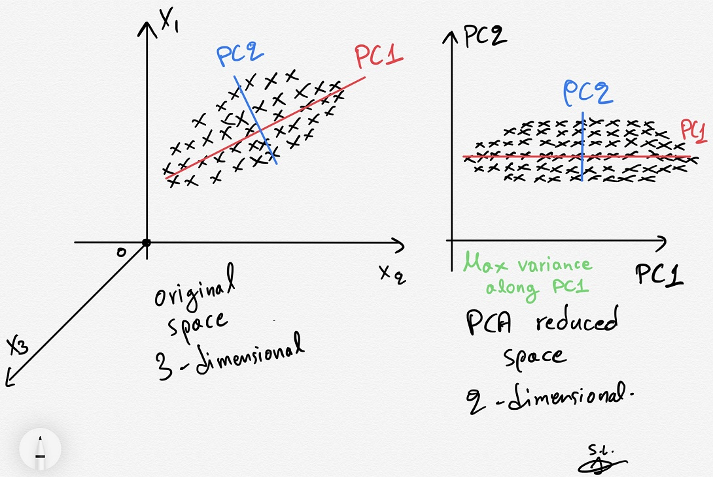
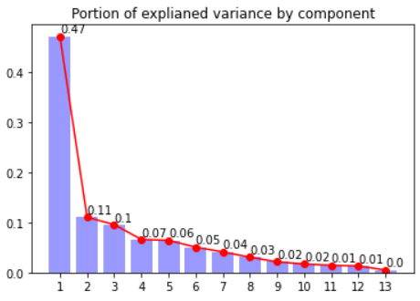
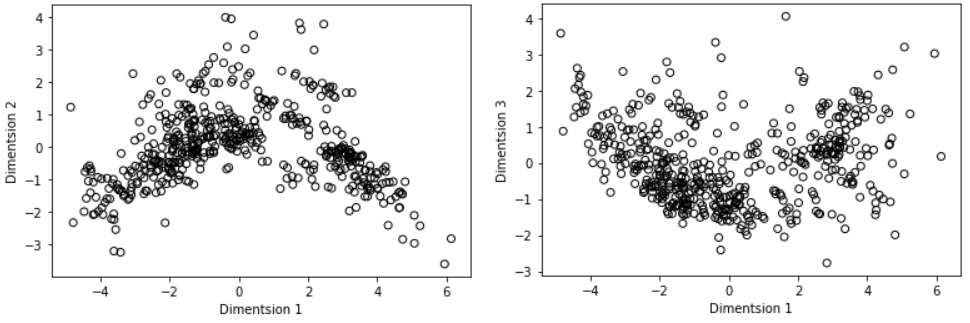

# 5. 이상치 (Outlier treatment)
   
이상치는 쉽게 말하면, **존나 말도 안되는 값이다.**  
쌀 가격을 예측하기 위해 쿠팡에서 데이터를 긁었다고 하자. 그런데 1Kg당 2천원~5천원에서 크게 벗어나지 않을 쌀 가격 데이터에서 만7천원짜리가 나온거다. 알고보니 쌀 과자 가격을 가져온거였음ㅋㅋ. 이렇게 예상치 못한 이상치를 처리해야 제대로 된 통계가 나온다.  

## 이상치 판별법
### 시그마 3
  
시그마 3(표준편차 3, 정확도 99%)을 벗어나는 놈을 이상치라고 본다. 하지만 이게 성립하기 위해서는 데이터셋이 정규분포를 따른다고 벅벅 우겨야지 성립되는 방법이기 때문에 **간편하지만 정말 무식한 방법**이라고 볼 수 있다.
### 박스플롯
  
백분위 25%~75%를 박스치면 이 박스 밖의 값을 이상치로 의심할 수 있다.   
특히 박스 길이의 1.5배는 '아 좀 애매한데', 박스 길이의 3배는 '얘는 거의 백퍼임'이라고 유추할 수 있다.

## 데이터셋에서 이상치 판별하기
matplotlib.pyplot 패키지의 boxplot 메소드를 사용하면 박스플롯을 쉽게 시각화 할 수 있다.
```python
boston = load_boston()
dataset = pd.DataFrame(boston.data, columns=boston.feature_names)
labels = boston.feature_names
X = dataset
y = boston.target
plt.boxplot(y,labels=('y'))
plt.show()
```
  
위의 결과를 보면 박스플롯 범위(IQR)를 벗어나는 값이 많은 것을 알 수 있다. 의심되는 녀석들이 많다는 뜻이다.
```python
def standardize(x) : 
    return (x-np.mean(x))/np.std(x)

scatter = plt.plot(linear_regression.fit(X,y).predict(X), standardize(residuals), 'o')
plt.plot([-10,50],[0,0],"r-")
plt.plot([-10,50],[3,3],"r--")
plt.plot([-10,50],[-3,-3],"r--")
plt.xlabel('fitted values')
plt.ylabel('standardized residuals')
plt.show()
```
  
실제로 잔차를 측정해보면 3시그마를 벗어나는 애들은 8개 정도밖에 없다.  
하지만 얘들을 무작정 지우기에는, 우측 상단에 선처럼 보이는 어떤 패턴이 신경쓰인다ㅋㅋㅋ  

## 예측변수에서 이상치 판별하기
예측한 결과가 이상치면 더욱 큰일난다. 회귀분석은 예측값-실제값으로 오차를 계산하기 때문에 이상치는 계수와 절편값에 큰 영향을 끼친다.  
```python
standarization = StandardScaler(with_mean=True, with_std=True)
Xs = standarization.fit_transform(X)
boxplot = plt.boxplot(Xs,labels=labels)
```
   
## 주성분 분석(PCA)
  
PCA는 복잡한 데이터셋에 가장 분산이 큰 방향으로 차원축소를 진행하여, 해당 데이터셋이 가장 말하고 싶어하는 정보(주성분)를 뽑아내는 기법이다. PCA가 진행되면 진행될 수록 데이터셋이 정말 말하고 싶은 정보만 남음.   
```python
from sklearn.decomposition import PCA
pca = PCA()
pca.fit(Xs)
C = pca.transform(Xs)
print(pca.explained_variance_ratio_)
```
```
[0.4713  0.11025 0.09559 0.06597 0.06422 0.05057
 0.04118 0.03047 0.0213 0.01694 0.01431 0.01302 0.00489]
```
차원 축소를 거듭할 수록 데이터셋에 대해 말하기 힘들어진다.  
(요약을 15번한 내용만 보고 본문을 설명해보라하면 힘든 느낌...)
```python
import numpy as np
import matplotlib.pyplot as plt
explained_variance = pca.explained_variance_ratio_
plt.title('Portion of explianed variance by component')
range_ = [r+1 for r in range(len(explained_variance))]
plt.bar(range_,explained_variance,color='b',alpha=0.4,align="center")
plt.plot(range_,explained_variance,'ro-')
for pos,pct in enumerate(explained_variance) : 
    plt.annotate(str(round(pct,2)), (pos+1,pct+0.007))
plt.xticks(range_)
plt.show()
```
  
각각 차원에 대해서 서로 비교를 진행한 모습  
```python
scatter = plt.scatter(C[:,0], C[:,1], facecolors='none', edgecolors='black')
plt.xlabel('Dimentsion 1')
plt.ylabel('Dimentsion 2')
```
```python
scatter = plt.scatter(C[:,0], C[:,2], facecolors='none', edgecolors='black')
plt.xlabel('Dimentsion 1')
plt.ylabel('Dimentsion 3')
```
  
 고차원과 저차원의 플롯은 본문과 요약본으로 비유할 수 있으며, 본문과 요약본이 많이 겹친다는 뜻은 애초에 본문이 일관성있다는 뜻. 요약할 만한게 없다는 거임.  
 즉, 위의 플롯을 봤을 때, 한 점으로 모일수록 일관성 있다는 뜻이다.

 ## 이상치 제거와 교체
 ### 드물게 나오는 경우
   
 그냥 신기하게 생긴 샘플일 가능성이 농후하다.  
 샘플 크기를 늘려서 이런 경우를 또 찾아보거나, 샘플을 제거하자.
 ### 데이터 처리과정에서 나오는 경우
 최대한 빨리 제거하자.  
 
 