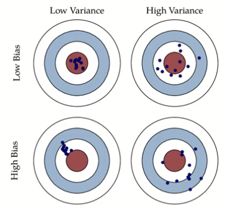
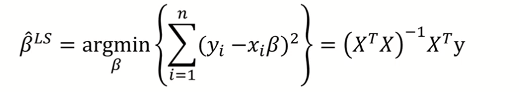
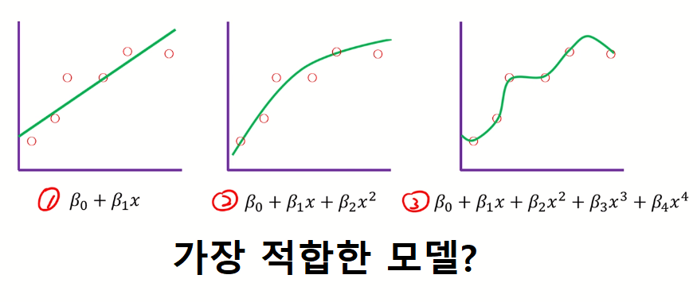
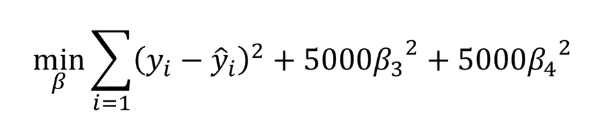
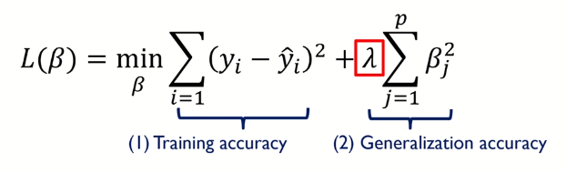
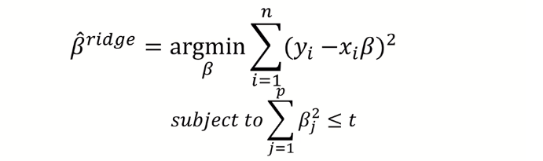
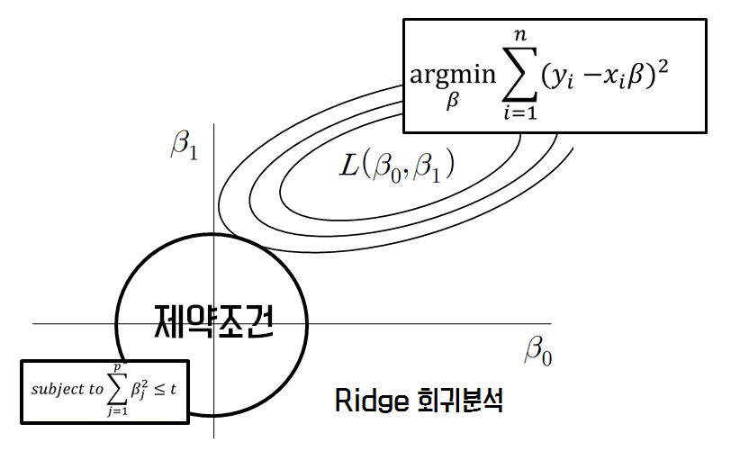
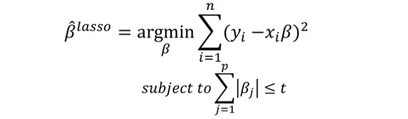
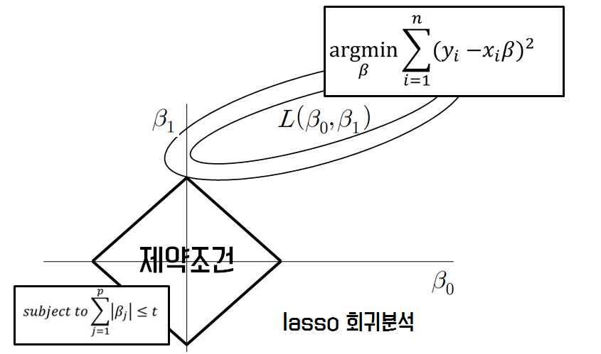

# 08. 고급 회귀분석 방법

**Good Model**

* Explanatory modeling : 현재 데이터(training data)를 잘 설명하는 모델
  * Training error를 최소화하는 모델

* Predictive modeling : 미래 데이터(testing data)에 대한 예측 성능이 좋은 모델

  * 예측 값의 MSE(Mean Squared Error)를 전개하면 Irreducible Error + Bias^2 + Variance로 나눌 수 있다.

  * Irreducible Error은 우리가 바꿀 수 없는 값이므로 Bias와 Variance를 최대한 줄여야 한다.

  *     

    (중앙에 가까울수록 정확함)  

## 기존 회귀분석 방법

### LSM

원래 우리가 쓰던 방법은 LSM(Least squared estimation method, 최소제곱법)이다.  

  

**(실제 값 - 예측 값)^2의 합이 최소가 되는 계수 값 베타를 찾자** 라는 의미이다.  

LSM은 Bias가 없기 때문에 상당히 성능이 좋다고 볼 수 있다. 그럼 위에서 말한 Good Model의 조건에 부합하는 놈일까?  

### Subset Selection

꼭 그렇다고는 볼 수 없다. 물론 bias가 없기 때문에 전체적인 성능이 좋긴 하지만, bias를 가지면서도 variance가 엄청 작은 모델은 LSM보다 좋을 수 있기 때문이다.  

위의 생각에서 나온 것이 바로 Subset selection method이다. 모든 독립변수 x를 사용하는 것이 아닌, 일부(subset)만 선택(selection)하여 회귀 계수를 추정하는 방법이다. 이는 LSM보다 bias는 증가할지 몰라도, 전체 variance가 감소하기 때문에 LSM보다 더 좋은 성능을 낼 수 있었다. 여기서 정규화에 대한 개념이 등장한다.  

## 정규화(Regularization)

### Concept

  

3번 모델은 현재 데이터(training data)에는 적합할 지 몰라도(bias가 작음),  

미래 데이터(testing data)에는 적합하지 않은 모델이라고 볼 수 있다(variance가 큼).  

이를 해결하기 위해서 **모델 복잡도에 대한 penalty를 부과**하는 방법을 사용한다. 

  

모델은 오차를 최소화하기 위해 β3와 β4에게 작은 값을 줄 것이고, 결국 모델이 전반적으로 일반화(regularization)되는 결과를 낳는다.

  

가장 기본적인 form은 위와 같다.  

하이퍼 파라미터 λ를 설정하여 (1)과 (2) 사이의 트레이드 오프를 적절하게 조절한다.   

결국, Regularization이란 bias를 늘이더라도 variance를 확실히 낮춰 정확도를 높이는 방법이다.  

### Ridge Regression

  

제일 처음 Regularization을 도입한 모델이다.  

***베타 제곱값의 합이 하이퍼 파라미터 t보다 작다*** 라는 penalty를 가진 Regularization 방법이다.  

 

위의 두 조건을 만족시키는(두 도형의 교차점)이 바로 Ridge Regression이 찾고자 하는 값이다.   

### LASSO

Least Absolute Shrinkage and Selection Operator(LASSO)는 Ridge Regression과는 다르게 ***베타의 절대값의 합이 하이퍼 파라미터 t보다 작다*** 라는 penalty를 가진 Regularization 방법이다.

  

LASSO는 제약 조건이 마름모꼴 형태다.  

Rigde와 가장 구별되는 차이점은, LASSO는 어떤 베타를 죽이고 어떤 베타를 살릴 것인지 선택할 수 있다.  

하지만 L1 Distance(절대값)을 사용하기 때문에 미분을 못해서 Optimization하기가 힘들다.  

이를 가능케 하는 것이 바로 LARS 알고리즘이다. 

1. 베타 값을 0으로 초기화한다.

2. y와 상관계수가 가장 높은 x_j를 찾는다

3. 계수 베타를 y 상관계수의 방향으로 조금씩 증가시킨다.

   중간에 계속 잔차 (r = y-y햇)을 계산하셈

   다른 x_k가 x_j의 잔차랑 비슷해지면 멈추셈

4. 베타_j랑 베타__k를 증가시키셈 지를 교차점 방향으로

   x_m이 잔차 r만큼 상관계수를 가지면 멈추셈

5. 베타_j랑 베타_k랑 베타_m을 증가시키셈 지를 교차점 방향으로

   x_n이 잔차 r만큼 비슷해지면